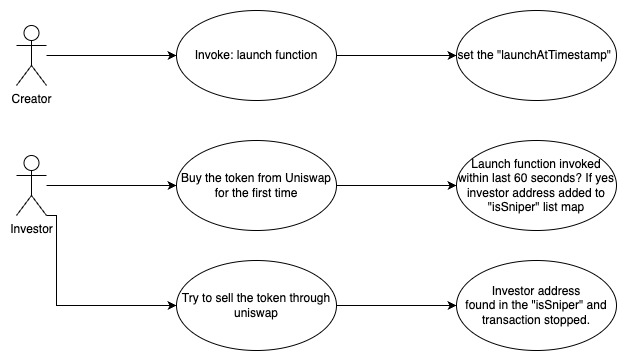

## Dwagon - [0x7ddf7aadbc1c816497286ceabb38532b34ba69c7](https://etherscan.io/address/0x7ddf7aadbc1c816497286ceabb38532b34ba69c7#code)
### 1. Introduction
This malicious contract incorporates a total of ten tricks, comprising six trapdoors within the conditional checking category, along with four trapdoors within the fee manipulation category. 

### 2. Analysis
- **_Blacklist checking on recipient address (Conditional checking):_**
  
  _The variable "isSniper" is a lsit/map designed to store addresses. Its population is restricted to the creator of the contract, granting them the exclusive ability to utilize it as a sale restrictive mechanism by adding the uniswapV2pair address into it._
  
- **_Blacklist checking on seller of the token (Conditional checking):_**
  
  _The variable "isSniper" is a lsit/map designed to store addresses. Its population is restricted to the creator of the contract, granting them the exclusive ability to utilize it as a mechanism for preventing selective investors from selling their tokens._

- **_Enabling and disabling transactions on Uniswap. (Conditional checking):_**
  
  _The variable "tradingActive" is initially set to false, serving as a default behavior. IN addition to leveraging this default behavior, the creator can manipulate the "\_isExcludedFromFees" list/map to add and remove the UniswapV2 pair address. This allows the creator to implement a malicious token sell restriction mechanism._

- **_Automatic investor blacklisting within 60 seconds of launch. (Conditional checking):_**

  _After the creator calls the "launch" function, any investor who sells or buys from the UniswapV2 pair will be automatically blacklisted using the "isSniper" list/map with the support of "launchedAtTimestamp" and "antiSnipingTime" variables._

- **_Invalid limitation update to maxTransactionAmount from creator (Conditional checking):_**

  _The creator can restrict sell transactions by setting the "maxTransactionAmount" variable to zero using the "updateMaxTxnAmount" function_

- **_Disabling investors from direct transferring the token (Conditional checking):_**

  _The variable "maxWallet" serves as a mechanism for the creator to restrict direct token transfers between token holders._

- **_Applying 90% sell fee by default (Fee manipulation):_**
  
  _This contract implements a default 90% fee on sell transactions by utilizing the "sellTotalFees" variable._

- **_Applying 90% buy fee by default (Fee manipulation):_**
  
  _This contract implements a default 90% fee on buy transactions by utilizing the "buyTotalFees" variable._


- **_Backdoor to update sell fees (Fee manipulation):_**

  _This contract inlude a backdoor to the creator of the contract to update the sell fees using the "updateSellFees" function._

- **_Backdoor to update buy fees (Fee manipulation):_**

  _This contract inlude a backdoor to the creator of the contract to update the sell fees using the "updateBuyFees" function._

### 3. Explanation
- **_Blacklist checking on recipient address (Conditional checking):_**

    ```solidity
    995:     function _transfer(
    996:         address from,
    997:         address to,
    998:         uint256 amount
    999:     ) internal override {
    1000:         require(from != address(0), "ERC20: transfer from the zero address");
    1001:         require(to != address(0), "ERC20: transfer to the zero address");
    1002:         require(!isSniper[to], "Sniper detected");
    1003:         require(!isSniper[from], "Sniper detected");
    1004: 
    1005:         if (amount == 0) {
    1006:             super._transfer(from, to, 0);
    1007:             return;
    1008:         }
    1009: 
    1010:         if (limitsInEffect) {
    1011:             if (
    1012:                 from != owner() &&
    1013:                 to != owner() &&
    1014:                 to != address(0) &&
    1015:                 to != address(0xdead) &&
    1016:                 !swapping
    1017:             ) {
    1018:                 if (!tradingActive) {
    1019:                     require(
    1020:                         _isExcludedFromFees[from] || _isExcludedFromFees[to],
    1021:                         "Trading is not active."
    1022:                     );
    1023:                 }
    1024:                 // antibot
    1025:                 if (
    1026:                     block.timestamp < launchedAtTimestamp + antiSnipingTime &&
    1027:                     from != address(uniswapV2Router)
    1028:                 ) {
    1029:                     if (from == uniswapV2Pair) {
    1030:                         isSniper[to] = true;
    1031:                     } else if (to == uniswapV2Pair) {
    1032:                         isSniper[from] = true;
    1033:                     }
    1034:                 }
    1035:                 //when buy
    1036:                 if (
    1037:                     automatedMarketMakerPairs[from] &&
    1038:                     !_isExcludedMaxTransactionAmount[to]
    1039:                 ) {
    1040:                     require(
    1041:                         amount <= maxTransactionAmount,
    1042:                         "Buy transfer amount exceeds the maxTransactionAmount."
    1043:                     );
    1044:                     require(
    1045:                         amount + balanceOf(to) <= maxWallet,
    1046:                         "Max wallet exceeded"
    1047:                     );
    1048:                 }
    1049:                 //when sell
    1050:                 else if (
    1051:                     automatedMarketMakerPairs[to] &&
    1052:                     !_isExcludedMaxTransactionAmount[from]
    1053:                 ) {
    1054:                     require(
    1055:                         amount <= maxTransactionAmount,
    1056:                         "Sell transfer amount exceeds the maxTransactionAmount."
    1057:                     );
    1058:                 } else if (!_isExcludedMaxTransactionAmount[to]) {
    1059:                     require(
    1060:                         amount + balanceOf(to) <= maxWallet,
    1061:                         "Max wallet exceeded"
    1062:                     );
    1063:                 }
    1064:             }
    1065:         }
    1066: 
    1067:         uint256 contractTokenBalance = balanceOf(address(this));
    1068: 
    1069:         bool canSwap = contractTokenBalance >= swapTokensAtAmount;
    1070: 
    1071:         if (
    1072:             canSwap &&
    1073:             swapEnabled &&
    1074:             !swapping &&
    1075:             !automatedMarketMakerPairs[from] &&
    1076:             !_isExcludedFromFees[from] &&
    1077:             !_isExcludedFromFees[to]
    1078:         ) {
    1079:             swapping = true;
    1080: 
    1081:             swapBack();
    1082: 
    1083:             swapping = false;
    1084:         }
    1085: 
    1086:         bool takeFee = !swapping;
    1087: 
    1088:         // if any account belongs to _isExcludedFromFee account then remove the fee
    1089:         if (_isExcludedFromFees[from] || _isExcludedFromFees[to]) {
    1090:             takeFee = false;
    1091:         }
    1092: 
    1093:         uint256 fees = 0;
    1094:         // only take fees on buys/sells, do not take on wallet transfers
    1095:         if (takeFee) {
    1096:             // on sell
    1097:             if (automatedMarketMakerPairs[to] && sellTotalFees > 0) {
    1098:                 fees = amount.mul(sellTotalFees).div(100);
    1099:                 tokensForLiquidity += (fees * sellLiquidityFee) / sellTotalFees;
    1100:                 tokensForDev += (fees * sellDevFee) / sellTotalFees;
    1101:                 tokensForMarketing += (fees * sellMarketingFee) / sellTotalFees;
    1102:                 tokensForTreasury += (fees * sellTreasuryFee) / sellTotalFees;
    1103:                 tokensForMelt = (fees * sellMeltingFee) / sellTotalFees;
    1104:             }
    1105:             // on buy
    1106:             else if (automatedMarketMakerPairs[from] && buyTotalFees > 0) {
    1107:                 fees = amount.mul(buyTotalFees).div(100);
    1108:                 tokensForLiquidity += (fees * buyLiquidityFee) / buyTotalFees;
    1109:                 tokensForDev += (fees * buyDevFee) / buyTotalFees;
    1110:                 tokensForMarketing += (fees * buyMarketingFee) / buyTotalFees;
    1111:                 tokensForTreasury += (fees * buyTreasuryFee) / buyTotalFees;
    1112:                 tokensForMelt = (fees * buyMeltingFee) / buyTotalFees;
    1113:             }
    1114: 
    1115:             if (fees > 0) {
    1116:                 _burn(from, tokensForMelt);
    1117:                 super._transfer(from, address(this), fees - tokensForMelt);
    1118:             }
    1119: 
    1120:             amount -= fees;
    1121:         }
    1122: 
    1123:         super._transfer(from, to, amount);
    1124:     }
    ```

    ```solidity
    981:     function addSniperInList(address _account) external onlyOwner {
    982:         require(
    983:             _account != address(uniswapV2Router),
    984:             "We can not blacklist router"
    985:         );
    986:         require(!isSniper[_account], "Sniper already exist");
    987:         isSniper[_account] = true;
    988:     }
    ``` 

    ```solidity
    990:     function removeSniperFromList(address _account) external onlyOwner {
    991:         require(isSniper[_account], "Not a sniper");
    992:         isSniper[_account] = false;
    993:     }
    ``` 

  

  _In the Dwagon conrtact both "transfer" and "transferFrom" function are inherited from the ERC20 contract. Both of these functions invoke the above shown overriden "\_transfer" funtion on the Dwagon contract. "At line number 1002, there is a "require" statement that checks if the "to" address is present in the "isSniper" list/map. The creator of the Dwagon contract has the ability to add addresses to this list/map by utilizing the "addSniperInList" function and remove addresses utilizing the "removeSniperFromList" function. By adding the uniswapV2pair address into this list, the creator effectively triggers a restriction at line number 1002, preventing investors from selling their tokens through the Uniswap platform."_
  
- **_Blacklist checking on seller of the token (Conditional checking):_**

  _At line number 1003, there is a "require" statement that checks if the "from" address is present in the "isSniper" list/map. The creator of the Dwagon contract has the ability to add addresses to this list/map by utilizing the "addSniperInList" function. By adding specific investor's addresses to this list, the creator effectively triggers a restriction on those investors from selling their tokens._

- **_Enabling and disabling transactions on Uniswap. (Conditional checking):_**

  ```solidity
    750:     bool public limitsInEffect = true;
    751:     bool public tradingActive = false;
    752:     bool public swapEnabled = false;
  ```

  ```solidity
    941:     function excludeFromFees(address account, bool excluded) public onlyOwner {
    942:         _isExcludedFromFees[account] = excluded;
    943:         emit ExcludeFromFees(account, excluded);
    944:     }
  ```

   

  _At line number 751, the "tradingActive" variable is initially set to true. Without changing its value, the subsequent code at line number 1018 within the "\_transfer" function will trigger the following "require" statement at line number 1019. This require statement verifies the presence of either the seller or recipient address in the "\_isExcludedFromFees" list/map. If either address is not found in the list/map, the transaction will be reverted. To control this trapdoor and implement a sell restrictive mechanism, the creator can use the "excludeFromFees" function to add or remove the UniswapV2 pair address from the "\_isExcludedFromFees" list/map. By doing so, the creator can selectively enable or disable transactions involving the UniswapV2 pair, thereby creating the desired sell restriction mechanism._  

- **_Automatic investor blacklisting within 60 seconds of launch. (Conditional checking):_**

  ```solidity
    754:     uint256 public launchedAt;
    755:     uint256 public launchedAtTimestamp;
    756:     uint256 antiSnipingTime = 60 seconds;
  ```

  ```solidity
    857:     function launch() public onlyOwner {
    858:         require(launchedAt == 0, "Already launched boi");
    859:         launchedAt = block.number;
    860:         launchedAtTimestamp = block.timestamp;
    861:         tradingActive = true;
    862:         swapEnabled = true;
    863:     }
  ```

  

  _At line number 756, the "antiSnipingTime" variable is initialized to 60 seconds. When the creator calls the "launch" function, the "launchedAtTimestamp" variable is assigned the current block number, and the require statement within the function body ensures that this function can only be called once._

  _The if condition at line number 1026 evaluates to true whenever a "transfer" or "transferFrom" function is called within a 60-second period after the "launch" function is invoked by the creator. When this condition evaluates to true, the investor's address is added to the "isSniper" list/map. Consequently, these blacklisted addresses are prevented from interacting further with the UniswapV2 pair._

- **_Invalid limitation update to maxTransactionAmount from creator (Conditional checking):_**

  ```solidity
    881:     function updateMaxTxnAmount(uint256 newNum) external onlyOwner {
    882:         maxTransactionAmount = newNum * (10**18);
    883:     }
  ```

    

  _The trap is activated when an investor attempts to sell the token through Uniswap. At line number 1055, a require statement is triggered, resulting in the execution of the trap if the "maxTransactionAmount" variable has been set to zero._

  _The creator can control the trap by using the "updateMaxTxnAmount" function. By passing a value of "0" to the "newNum" argument in the "updateMaxTxnAmount" function, the creator sets the "maxTransactionAmount" variable to zero. This effectively enables the creator to impose a sell restrictive mechanism, as any sell transactions exceeding the maximum transaction amount will be reverted._

- **_Disabling investors from direct transferring the token (Conditional checking):_**

  ```solidity
    885:     function updateMaxWalletAmount(uint256 newNum) external onlyOwner {
    886:         maxWallet = newNum * (10**18);
    887:     }
  ```

  

  _The trap is activated when a transfer transaction occurs, excluding interactions with the UniswapV2 pair and addresses listed in the "\_isExcludedMaxTransactionAmount" list/map. At line number 1059, a require statement is triggered, checking if the recipient's total balance after the transfer is less than the "maxWallet" size. The creator can control the trap by utilizing the "updateMaxWalletAmount" function. By setting the "maxWallet" variable to zero. This control mechanism prevents investors from directly transferring tokens to another party._

- **_Applying 90% sell fee by default (Fee manipulation):_**

    ```solidity
    765:     uint256 public sellTotalFees = 90;
    766:     uint256 public sellMarketingFee = 89;
    767:     uint256 public sellLiquidityFee = 0;
    768:     uint256 public sellMeltingFee = 0;
    769:     uint256 public sellTreasuryFee = 0;
    770:     uint256 public sellDevFee = 1;
    ```

    

    _In line number 765, the variable "sellTotalFees" has been intentionally set to "90". This results in a 90% fee being imposed on sell transactions, as evident in line number 1098. Such behavior strongly suggests malicious intent on the creator._ 
    
- **_Applying 90% buy fee by default (Fee manipulation):_**

    ```solidity
    758:     uint256 public buyTotalFees = 90;
    759:     uint256 public buyMarketingFee = 89;
    760:     uint256 public buyTreasuryFee = 0;
    761:     uint256 public buyLiquidityFee = 0;
    762:     uint256 public buyMeltingFee = 0;
    763:     uint256 public buyDevFee = 1;
    ```

    

    _In line number 765, the variable "buyTotalFees" has been intentionally set to "90". This results in a 90% fee being imposed on buy transactions, as evident in line number 1107. Such behavior strongly suggests malicious intent on the creator._ 

- **_Backdoor to update sell fees (Fee manipulation):_**

  ```solidity
    920:     function updateSellFees(
    921:         uint256 _marketingFee,
    922:         uint256 _liquidityFee,
    923:         uint256 _devFee,
    924:         uint256 _treasuryFee,
    925:         uint256 _meltingFee
    926:     ) external onlyOwner {
    927:         sellMarketingFee = _marketingFee;
    928:         sellLiquidityFee = _liquidityFee;
    929:         sellDevFee = _devFee;
    930:         sellTreasuryFee = _treasuryFee;
    931:         sellMeltingFee = _meltingFee;
    932:         sellTotalFees =
    933:             sellMarketingFee +
    934:             sellLiquidityFee +
    935:             sellDevFee +
    936:             sellTreasuryFee +
    937:             sellMeltingFee;
    938:         require(sellTotalFees <= 30, "Must keep fees at 11% or less");
    939:     }
  ```

    

    _The creator of this contract has the ability to manipulate the "sellTotalFees" variable through the "updateSellFees" function, allowing them to set it to any value below 30. This level of control over fee adjustments is considered unethical and falls into the category of potentially malicious activity. This updated value will be used in the line number 1107 to calculate the fee during a sell transaction via uniswapV2pair._

- **_Backdoor to update buy fees (Fee manipulation):_**
  
     ```solidity
    901:     function updateBuyFees(
    902:         uint256 _marketingFee,
    903:         uint256 _liquidityFee,
    904:         uint256 _treasuryFee,
    905:         uint256 _meltingFee
    906:     ) external onlyOwner {
    907:         buyMarketingFee = _marketingFee;
    908:         buyLiquidityFee = _liquidityFee;
    909:         buyMeltingFee = _meltingFee;
    910:         buyTreasuryFee = _treasuryFee;
    911:         buyTotalFees =
    912:             buyMarketingFee +
    913:             buyTreasuryFee +
    914:             buyLiquidityFee +
    915:             buyDevFee +
    916:             buyMeltingFee;
    917:         require(buyTotalFees <= 30, "Must keep fees at 11% or less");
    918:     }
     ```

     

  _The creator of this contract has the ability to manipulate the "buyTotalFees" variable through the "updatebuyFees" function, allowing them to set it to any value below 30. This level of control over fee adjustments is considered unethical and falls into the category of potentially malicious activity. This updated value will be used in the line number 1107 to calculate the fee during a buy transaction via uniswapV2pair._

