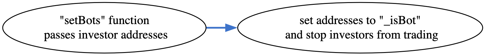

## CALCIFERBURNINU - [0x59C4378e31E36bb214cEEe53B481EA11cFD8a6B9](https://etherscan.io/address/0x59c4378e31e36bb214ceee53b481ea11cfd8a6b9#code)

### 1. Introduction
This malicious contract incorporates a total of four tricks, comprising two trapdoors within the conditional checking category, along with two trapdoors within the fee manipulation category. 

### 2. Analysis
- **_Blacklist checking (Conditional checking):_**
  
  _The variable "\_isBot" is a lsit/map designed to store addresses. Its population is restricted to the creator of the contract via "setBots" function, granting them the exclusive ability to utilize it as a mechanism for preventing selective investors from selling their tokens._
  
- **_whitelisting checking (Conditional checking):_**
  
  _The creator has the ability to modify "\_isExcludedFromFee" list/map and "tradingEnable" variable through "setExcludeFromFee" and "setTradingEnable" functions respectively. creatong a pathway into a sell restrictive mechanism._ 
  
- **_Applying 30% fee on sell transactions (Fee manipulation):_**
  
  _The "\_getFeeSell" function performs an initial calculation of a 5% fee, which is stored in the "dev" variable. Furthermore, this function calls the "getSellBurnCount" function to determine an additional fee of either 5% or 25%, depending on the balance in the uniswapV2pair. Consequently, the maximum fee charged on a sell transaction amounts to 30%._
  
- **_Applying 10% fee on buy transactions (Fee manipulation):_**
  
  _The "\_getFreeBuy" function calculates a total fee of 10% using magic numbers embedded within the code, which are then assigned to the "dev" and "burn" variables within the function body._
  

### 3. Explanation
- **_Blacklist checking (Conditional checking):_**

    ```solidity
    375:     function _transfer(
    376:         address from,
    377:         address to,
    378:         uint256 amount
    379:     ) internal override {
    380:         require(_balances[from] >= amount);
    381:         require(!_isBot[from]);
    382: 
    383:         
    384:         if (from == uniswapV2Pair && !_isExcludedFromFee[to]) {
    385:             require(tradingEnable, "trading disabled");
    386:             require(amount<_maxTxAmount);
    387:             amount = _getFeeBuy(from, amount);
    388:         }
    389: 
    390:         
    391:         if (
    392:             !_inSwap &&
    393:             uniswapV2Pair != address(0) &&
    394:             to == uniswapV2Pair &&
    395:             !_isExcludedFromFee[from]
    396:         ) {
    397:             require(tradingEnable);
    398:             amount = _getFeeSell(amount, from);
    399:             uint256 contractTokenBalance = balanceOf(address(this));
    400:             if (contractTokenBalance > 0) {
    401:                 uint256 swapCount = contractTokenBalance;
    402:                 uint256 maxSwapCount = 2 * amount;
    403:                 if (swapCount > maxSwapCount) swapCount = maxSwapCount;
    404:                 _swapTokensForEth(swapCount, _uniswapV2Router);
    405:             }
    406:         }
    407: 
    408:         
    409:         super._transfer(from, to, amount);
    410:     }
    ```

    ```solidity
    477:     function setBots(address[] memory bots_) public onlyOwner() {
    478:         for (uint i = 0; i < bots_.length; i++) {
    479:             if (bots_[i] != uniswapV2Pair && bots_[i] != address(_uniswapV2Router)) {
    480:                 _isBot[bots_[i]] = true;
    481:             }
    482:         }
    483:     }
    ``` 

    ```solidity
    485:     function delBots(address[] memory bots_) public onlyOwner() {
    486:         for (uint i = 0; i < bots_.length; i++) {
    487:             _isBot[bots_[i]] = false;
    488:         }
    489:     }
    ```

  

  _The trap it can be found within the "\_transfer" function, at line number 381._
  
  _At line number 381, there is a "require" statement that verifies whether the "from" address is not included in the "\_isBot" list/map. If the "from" address is present in this list/map, "require" statement is executed, triggering the trap and preventing that particular investor from selling their tokens._

  _The creator of the contract holds control over the trap through the manipulation of the "\_isBot" list/map. By utilizing the "setBots" and "delBots" functions, the creator can add or remove addresses from the "\_isBot" list/map, thus enforcing a sell restriction mechanism. The creator has the power to determine which addresses are included in the "\_isBot" list/map, granting them control over the functionality of the trap._


- **_whitelisting checking (Conditional checking):_**

    ```solidity
    462:     function setExcludeFromFee(address[] memory accounts, bool value)
    463:         external
    464:         onlyOwner
    465:     {
    466:         for (uint256 i = 0; i < accounts.length; ++i) {
    467:             _isExcludedFromFee[accounts[i]] = value;
    468:         }
    469:     }
    ```

    ```solidity
    471:     function setTradingEnable(bool value) external onlyOwner {
    472:         tradingEnable = value;
    473:     }
    ```

  _At line number 395, an if condition checks whether the "from" address is absent from the "\_isExcludedFromFee" list/map. If the "from" address is not present or its value is set to false, the code at line number 397 is executed. The require statement at line number 397 verifies the value of the "tradingEnable" variable. If the variable is false, the transaction is reverted, activating the trap._

  _The creator of the contract holds control over the trap through the manipulation of two factors. Firstly, the creator can modify the values in the "\_isExcludedFromFee" list/map by using the "setExcludeFromFee" function. This enables the creator to whitelist specific addresses and exempt them from the sell restriction mechanism imposed by the trap. Secondly, the creator can control the "tradingEnable" variable using the "setTradingEnable" function. By setting the variable to true or false, the creator determines whether the trap is activated or deactivated, effectively enabling or disabling the sell restriction mechanism for all investors, except those whitelisted in the "\_isExcludedFromFee" list/map._
  
  
- **_Applying 30% fee on sell transactions (Fee manipulation):_**

    ```solidity
    444:     function _getFeeSell(uint256 amount, address account)
    445:         private
    446:         returns (uint256)
    447:     {
    448:         uint256 dev = amount / 20; 
    449:         uint256 burn = getSellBurnCount(amount); 
    450: 
    451:         amount -= dev + burn;
    452:         _balances[account] -= dev + burn;
    453:         _balances[address(this)] += dev;
    454:         _balances[BURN_ADDRESS] += burn;
    455:         _totalSupply -= burn;
    456:         emit Transfer(address(account), address(this), dev);
    457:         emit Transfer(address(account), BURN_ADDRESS, burn);
    458: 
    459:         return amount;
    460:     }
    ```

    ```solidity
    428:     function getSellBurnCount(uint256 amount) public view returns (uint256) {
    429:         
    430:         uint256 poolSize = _balances[uniswapV2Pair];
    431:         uint256 vMin = poolSize / 100; 
    432:         if (amount <= vMin) return amount / 20; 
    433:         uint256 vMax = poolSize / 20; 
    434:         if (amount > vMax) return amount / 4; 
    435: 
    436:         
    437:         return
    438:             amount /
    439:             20 +
    440:             (((amount - vMin) * 20 * amount) / (vMax - vMin)) /
    441:             100;
    442:     }   
    ```

   _At line number 448, the "\_getFreeSell" function calculates a fee of 5%. Additionally, at line number 449, the function "getSellBurnCount" is invoked. Within this function, a fee of 5% is calculated if the amount to be transferred is less than 1% of the current liquidity available in the uniswapV2pair. However, if the transfer amount exceeds this threshold, a hefty fee of 25% is applied. The resulting fee, either 10% or 30%, is deducted from the sender's account at line number 452._

- **_Applying 10% fee on buy transactions (Fee manipulation):_**

    ```solidity
    412:     function _getFeeBuy(address from, uint256 amount)
    413:         private
    414:         returns (uint256)
    415:     {
    416:         uint256 dev = amount / 20; 
    417:         uint256 burn = amount / 20; 
    418:         amount -= dev + burn;
    419:         _balances[from] -= dev + burn;
    420:         _balances[address(this)] += dev;
    421:         _balances[BURN_ADDRESS] += burn;
    422:         _totalSupply -= burn;
    423:         emit Transfer(from, address(this), dev);
    424:         emit Transfer(from, BURN_ADDRESS, burn);
    425:         return amount;
    426:     }
    ```

    _Within the "\_transfer" function, at line number 387, the trap is set in motion by calling the "\_getFeeBuy" function. The calculations at line numbers 416 and 417 within this function result in the determination of a 5% fee for each component, reflected in the "dev" and "burn" variables. However, it's important to note that the total fee amounts to 10%, as the fees from both components are combined. This total fee is deducted from the sender's account at line number 419, leaving the remaining amount to proceed with the transaction. Thus, the trap entails a total fee of 10%_
    
  
