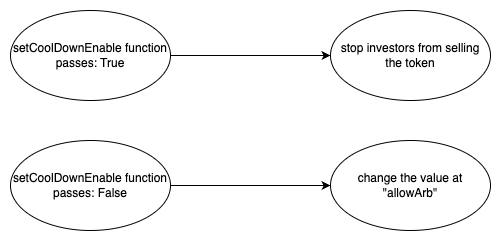
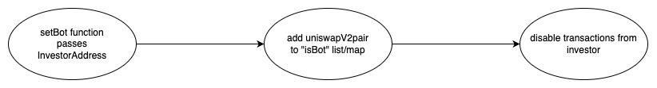
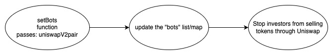
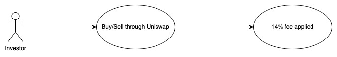

## DiamondDoge - [0x2aFD733831AE1ec777c0a186B04304B78289eAC7](https://etherscan.io/address/0x2afd733831ae1ec777c0a186b04304b78289eac7#code)
### 1. Introduction
This malicious contract incorporates a total of four tricks, comprising three trapdoors within the conditional checking category, along with one trapdoor within the fee manipulation category. 

### 2. Analysis
  
- **_Backdoor to enable and disable token selling (Conditional checking):_**
  
  _The creator has the capability to modify the "cooldownEnabled" variable through the "setCooldownEnabled" function, allowing the activation of the sell restriction mechanism._ 
  
- **_Blacklist checking (Conditional checking):_**
  
  _The variable "bots" is a lsit/map designed to store addresses. Its population is restricted to the creator of the contract, granting them the exclusive ability to utilize it as a mechanism for preventing selective investors from selling their tokens._
  
- **_Blacklist uniswapV2pair (Conditional checking):_**
  
  _The variable "bots" is a lsit/map designed to store addresses. Its population is restricted to the creator of the contract, granting them the exclusive ability to utilize it as a mechanism for preventing all investors from selling their tokens by adding uniswapV2pair address to the "bots" list/map._

- **_Default 14% fee (Fee manipulation):_**
  
  _This contract incorporates a default fee of 14% for both buy and sell transactions. 12% of this fee is applied using a magic number within the code._

### 3. Explanation
- **_Backdoor to enable and disable token selling (Conditional checking):_**

    ```solidity
    320:     function _transfer(
    321:         address from,
    322:         address to,
    323:         uint256 amount
    324:     ) private {
    325:         require(from != address(0), "ERC20: transfer from the zero address");
    326:         require(to != address(0), "ERC20: transfer to the zero address");
    327:         require(amount > 0, "Transfer amount must be greater than zero");
    328: 
    329:         if (from != owner() && to != owner()) {
    330:             if (cooldownEnabled) {
    331:                 if (
    332:                     from != address(this) &&
    333:                     to != address(this) &&
    334:                     from != address(uniswapV2Router) &&
    335:                     to != address(uniswapV2Router)
    336:                 ) {
    337:                     require(
    338:                         _msgSender() == address(uniswapV2Router) ||
    339:                             _msgSender() == uniswapV2Pair,
    340:                         "ERR: Uniswap only"
    341:                     );
    342:                 }
    343:             }
    344:             require(amount <= _maxTxAmount);
    345:             require(!bots[from] && !bots[to]);
    346:             if (
    347:                 from == uniswapV2Pair &&
    348:                 to != address(uniswapV2Router) &&
    349:                 !_isExcludedFromFee[to] &&
    350:                 cooldownEnabled
    351:             ) {
    352:                 require(cooldown[to] < block.timestamp);
    353:                 cooldown[to] = block.timestamp + (60 seconds);
    354:             }
    355:             uint256 contractTokenBalance = balanceOf(address(this));
    356:             if (!inSwap && from != uniswapV2Pair && swapEnabled) {
    357:                 swapTokensForEth(contractTokenBalance);
    358:                 uint256 contractETHBalance = address(this).balance;
    359:                 if (contractETHBalance > 0) {
    360:                     sendETHToFee(address(this).balance);
    361:                 }
    362:             }
    363:         }
    364:         bool takeFee = true;
    365: 
    366:         if (_isExcludedFromFee[from] || _isExcludedFromFee[to]) {
    367:             takeFee = false;
    368:         }
    369: 
    370:         _tokenTransfer(from, to, amount, takeFee);
    371:     }
    ```

    ```solidity
    281:     function setCooldownEnabled(bool onoff) external onlyOwner() {
    282:         cooldownEnabled = onoff;
    283:     }
     ``` 

  

    _The "\_transfer" function is invoked by both the "transfer" and "transferFrom" functions in the DiamondDoge contract._

    _This trap is activated when an investor tries to sell the token, and the value of the "coolDownEnable" variable is set to true._

    _The creator of the contract can control this trap by using the "setCooldownEnabled" function, which allows them to enable or disable the "coolDownEnable" variable. When "coolDownEnable" is set to true, any sell transaction from the investor will trigger the "require" statement at line number 337, causing the transaction to be reverted. This results in a sell restriction mechanism, as investors are prevented from selling the token_

  
- **_Blacklist checking (Conditional checking):_**

    ```solidity
    430:     function setBots(address[] memory bots_) public onlyOwner {
    431:         for (uint256 i = 0; i < bots_.length; i++) {
    432:             bots[bots_[i]] = true;
    433:         }
    434:     }
    ```

    ```solidity
    436:     function delBot(address notbot) public onlyOwner {
    437:         bots[notbot] = false;
    438:     }
    ```

    

   _This trap is activated when an investor who is present in the "bots" list/map tries to make a transaction._

   _The creator of the contract can control this trap by using the "setBots" function. By adding specific investor addresses to the "bots" list/map, the creator can effectively blacklist those investors from selling their tokens. As a result, any transaction from those blacklisted addresses will be reverted at the "require" statement at line number 345, acting as a sell restriction mechanism._

- **_Blacklist uniswapV2pair (Conditional checking):_**
    
    

    _This trap is activated when an investor tries to transfer tokens to an address that is present in the "bots" list/map._

    _The creator of the contract can control this trap by using the "setBots" function. By adding the uniswapV2pair address to the "bots" list/map, the creator can effectively create a sell restriction mechanism for all investors. As a result, any transaction to the blacklisted Uniswap address will be reverted at the "require" statement at line number 345, preventing investors from selling their tokens._


- **_Default 14% fee (Fee manipulation):_**

    ```solidity
    440:     function _tokenTransfer(
    441:         address sender,
    442:         address recipient,
    443:         uint256 amount,
    444:         bool takeFee
    445:     ) private {
    446:         if (!takeFee) removeAllFee();
    447:         _transferStandard(sender, recipient, amount);
    448:         if (!takeFee) restoreAllFee();
    449:     }
    ```

    ```solidity
    451:     function _transferStandard(
    452:         address sender,
    453:         address recipient,
    454:         uint256 tAmount
    455:     ) private {
    456:         (
    457:             uint256 rAmount,
    458:             uint256 rTransferAmount,
    459:             uint256 rFee,
    460:             uint256 tTransferAmount,
    461:             uint256 tFee,
    462:             uint256 tTeam
    463:         ) = _getValues(tAmount);
    464:         _rOwned[sender] = _rOwned[sender].sub(rAmount);
    465:         _rOwned[recipient] = _rOwned[recipient].add(rTransferAmount);
    466:         _takeTeam(tTeam);
    467:         _reflectFee(rFee, tFee);
    468:         emit Transfer(sender, recipient, tTransferAmount);
    469:     }
    ```

    ```solidity
    484:     function _getValues(uint256 tAmount)
    485:         private
    486:         view
    487:         returns (
    488:             uint256,
    489:             uint256,
    490:             uint256,
    491:             uint256,
    492:             uint256,
    493:             uint256
    494:         )
    495:     {
    496:         (uint256 tTransferAmount, uint256 tFee, uint256 tTeam) =
    497:             _getTValues(tAmount, _taxFee, 12);
    498:         uint256 currentRate = _getRate();
    499:         (uint256 rAmount, uint256 rTransferAmount, uint256 rFee) =
    500:             _getRValues(tAmount, tFee, tTeam, currentRate);
    501:         return (rAmount, rTransferAmount, rFee, tTransferAmount, tFee, tTeam);
    502:     }
    ```

    ```solidity
    504:     function _getTValues(
    505:         uint256 tAmount,
    506:         uint256 taxFee,
    507:         uint256 TeamFee
    508:     )
    509:         private
    510:         pure
    511:         returns (
    512:             uint256,
    513:             uint256,
    514:             uint256
    515:         )
    516:     {
    517:         uint256 tFee = tAmount.mul(taxFee).div(100);
    518:         uint256 tTeam = tAmount.mul(TeamFee).div(100);
    519:         uint256 tTransferAmount = tAmount.sub(tFee).sub(tTeam);
    520:         return (tTransferAmount, tFee, tTeam);
    521:     }
    ```

    

    _This trap is activated when the "\_getTValues" function is called with a magic number "12" as the last argument._

    _The creator of the contract wields control over this trap by deciding what value to pass as the last argument when calling the "_getTValues" function. By providing the magic number "12," the creator manipulates the fee calculation process, resulting in a total of 14% fees being applied to transactions. It's essential to understand that this particular fee calculation involves multiple function calls._
    
  
