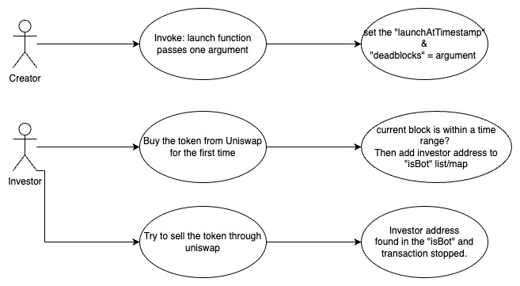

## EasyINU - [0x93FE5Eabd054524FDaaEae7913a90bF73889EBF9](https://etherscan.io/address/0x93fe5eabd054524fdaaeae7913a90bf73889ebf9#code)
### 1. Introduction
This malicious contract incorporates a trapdoor within the conditional checking category. 

### 2. Analysis

- **_Automatic investor blacklisting within a time period (Conditional checking):_**

  _The "launch" function allows the creator to set a desired value for the "deadblocks" variable. By doing so, the investors' addresses can be added to the "isBot" list/map, effectively blacklisting them within a given time period. This blacklist serves as a sell restriction mechanism for those investors, preventing them from carrying out transactions_

### 3. Explanation

- **_Automatic investor blacklisting within a time period (Conditional checking):_**

  ```solidity
    275:     function _transfer(address sender, address recipient, uint256 amount) internal override {
    276:         require(amount > 0, "Transfer amount must be greater than zero");
    277:         require(!isBot[sender] && !isBot[recipient], "You can't transfer tokens");
    278:                 
    279:         
    280:         if(!excludedFromFees[sender] && !excludedFromFees[recipient] && !swapping){
    281:             require(tradingEnabled, "Trading not active yet");
    282:             if(genesis_block + deadblocks > block.number){
    283:                 if(recipient != pair) isBot[recipient] = true;
    284:                 if(sender != pair) isBot[sender] = true;
    285:             }
    286:             require(amount <= maxTxAmount, "You are exceeding maxTxAmount");
    287:             if(recipient != pair){
    288:                 require(balanceOf(recipient) + amount <= maxWalletAmount, "You are exceeding maxWalletAmount");
    289:             }
    290:         }
    291: 
    292:         uint256 fee;
    293:         
    294:         //set fee to zero if fees in contract are handled or exempted
    295:         if (swapping || excludedFromFees[sender] || excludedFromFees[recipient]) fee = 0;
    296:         
    297:         //calculate fee
    298:         else{
    299:             if(recipient == pair) fee = amount * totSellTax / 100;
    300:             else fee = amount * totTax / 100;
    301:         }
    302:         
    303:         //send fees if threshold has been reached
    304:         //don't do this on buys, breaks swap
    305:         if (swapEnabled && !swapping && sender != pair && fee > 0) swapForFees();
    306: 
    307:         super._transfer(sender, recipient, amount - fee);
    308:         if(fee > 0) super._transfer(sender, address(this) ,fee);
    309: 
    310:     }
  ```

  ```solidity
    382:     function enableTrading(uint256 numOfDeadBlocks) external onlyOwner {
    383:         require(!tradingEnabled, "Trading already active");
    384:         tradingEnabled = true;
    385:         swapEnabled = true;
    386:         genesis_block = block.number;
    387:         deadblocks = numOfDeadBlocks;
    388:     }
  ```

  

  _The "transfer" and "transferFrom" functions in the EasyINU contract inherit their functionality from the ERC20 contract. These functions, when invoked, utilize the overridden "\_transfer" function within the EasyINU contract to perform the token transfer operations._

  _The trap is located in the if condition at line number 282 within the "\_transfer" function. This condition checks if the current block is within a specific range defined by the "genesis\_block" and "deadblocks" variables._

  _This trap is activated when the current block falls within the specified range. If the condition is met, it indicates that the transaction is occurring within the designated timeframe._

  _The creator has control over this trap through the "enableTrading" function. By calling this function, the creator sets the "genesis\_block" variable to the current block value, marking the starting point for the blacklisting mechanism. Additionally, the creator can pass a value through the function argument to set the "deadblocks" variable, determining the number of blocks ahead for which the automatic blacklisting feature will be active._

  _For example, if the "deadblocks" value is set to 5760, it means that the blacklisting mechanism will be active for the next 5760 blocks. Considering an average block time of 15 seconds in Ethereum, this translates to 86400 seconds or 24 hours. During this period, any transactions falling within the specified block range will trigger the blacklisting mechanism, resulting in the investor's address being added to the "isBot" list/map. Subsequently, the transaction will be reverted by the "require" statement at line number 277, effectively implementing a sell restriction mechanism for the blacklisted investors._