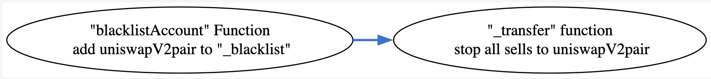
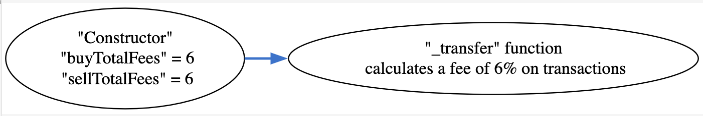

## Fritz - [0x2804D3C29590CC7D52487b43e1129b847B8b1e02](https://etherscan.io/address/0x2804D3C29590CC7D52487b43e1129b847B8b1e02#code)
### 1. Introduction
This malicious contract incorporates a total of two tricks, comprising one trapdoor within the conditional checking category, along with one trapdoor within the fee manipulation category. 

### 2. Analysis
- **_Blacklist checking on recipient address (Conditional checking):_**
  
  _The variable "\_blacklist" is a lsit/map designed to store addresses. Its population is restricted to the creator of the contract, granting them the exclusive ability to utilize it as a sale restrictive mechanism by adding the uniswapV2pair address into it._
  
- **_Applying a 6% fee on token transfers (Fee manipulation):_**
  
  _The variables "sellTotalFees" and "buyTotalFees" apply a fee of 6% on both buy and sell transactions. It's important to note that fee mechanisms exceeding 5% are regarded as malicious._

### 3. Explanation
- **_Blacklist checking on recipient address (Conditional checking):_**

  ```solidity
  1084:     function _transfer(
  1085:         address from,
  1086:         address to,
  1087:         uint256 amount
  1088:     ) internal override {
  1089:         require(from != address(0), "ERC20: transfer from the zero address");
  1090:         require(to != address(0), "ERC20: transfer to the zero address");
  1091:         require(!_blacklist[to] && !_blacklist[to], "You have been blacklisted from transfering tokens");
  1092:          if(amount == 0) {
  1093:             super._transfer(from, to, 0);
  1094:             return;
  1095:         }
  1096:  
  1097:         if(limitsInEffect){
  1098:             if (
  1099:                 from != owner() &&
  1100:                 to != owner() &&
  1101:                 to != address(0) &&
  1102:                 to != address(0xdead) &&
  1103:                 !swapping
  1104:             ){
  1105:                 if(!tradingActive){
  1106:                     require(_isExcludedFromFees[from] || _isExcludedFromFees[to], "Trading is not active.");
  1107:                 }
  1108:  
  1109:                 // at launch if the transfer delay is enabled, ensure the block timestamps for purchasers is set -- during launch.  
  1110:                 if (transferDelayEnabled){
  1111:                     if (to != owner() && to != address(uniswapV2Router) && to != address(uniswapV2Pair)){
  1112:                         require(_holderLastTransferTimestamp[tx.origin] < block.number, "_transfer:: Transfer Delay enabled.  Only one purchase per block allowed.");
  1113:                         _holderLastTransferTimestamp[tx.origin] = block.number;
  1114:                     }
  1115:                 }
  1116:  
  1117:                 //when buy
  1118:                 if (automatedMarketMakerPairs[from] && !_isExcludedMaxTransactionAmount[to]) {
  1119:                         require(amount <= maxTransactionAmount, "Buy transfer amount exceeds the maxTransactionAmount.");
  1120:                         require(amount + balanceOf(to) <= maxWallet, "Max wallet exceeded");
  1121:                 }
  1122:  
  1123:                 //when sell
  1124:                 else if (automatedMarketMakerPairs[to] && !_isExcludedMaxTransactionAmount[from]) {
  1125:                         require(amount <= maxTransactionAmount, "Sell transfer amount exceeds the maxTransactionAmount.");
  1126:                 }
  1127:                 else if(!_isExcludedMaxTransactionAmount[to]){
  1128:                     require(amount + balanceOf(to) <= maxWallet, "Max wallet exceeded");
  1129:                 }
  1130:             }
  1131:         }
  1132:  
  1133:         uint256 contractTokenBalance = balanceOf(address(this));
  1134:  
  1135:         bool canSwap = contractTokenBalance >= swapTokensAtAmount;
  1136:  
  1137:         if( 
  1138:             canSwap &&
  1139:             swapEnabled &&
  1140:             !swapping &&
  1141:             !automatedMarketMakerPairs[from] &&
  1142:             !_isExcludedFromFees[from] &&
  1143:             !_isExcludedFromFees[to]
  1144:         ) {
  1145:             swapping = true;
  1146:  
  1147:             swapBack();
  1148:  
  1149:             swapping = false;
  1150:         }
  1151:  
  1152:         bool takeFee = !swapping;
  1153:  
  1154:         // if any account belongs to _isExcludedFromFee account then remove the fee
  1155:         if(_isExcludedFromFees[from] || _isExcludedFromFees[to]) {
  1156:             takeFee = false;
  1157:         }
  1158:  
  1159:         uint256 fees = 0;
  1160:         // only take fees on buys/sells, do not take on wallet transfers
  1161:         if(takeFee){
  1162:             // on sell
  1163:             if (automatedMarketMakerPairs[to] && sellTotalFees > 0){
  1164:                 fees = amount.mul(sellTotalFees).div(100);
  1165:                 tokensForLiquidity += fees * sellLiquidityFee / sellTotalFees;
  1166:                 tokensForDev += fees * sellDevFee / sellTotalFees;
  1167:                 tokensForMarketing += fees * sellMarketingFee / sellTotalFees;
  1168:             }
  1169:             // on buy
  1170:             else if(automatedMarketMakerPairs[from] && buyTotalFees > 0) {
  1171:                 fees = amount.mul(buyTotalFees).div(100);
  1172:                 tokensForLiquidity += fees * buyLiquidityFee / buyTotalFees;
  1173:                 tokensForDev += fees * buyDevFee / buyTotalFees;
  1174:                 tokensForMarketing += fees * buyMarketingFee / buyTotalFees;
  1175:             }
  1176:  
  1177:             if(fees > 0){    
  1178:                 super._transfer(from, address(this), fees);
  1179:             }
  1180:  
  1181:             amount -= fees;
  1182:         }
  1183:  
  1184:         super._transfer(from, to, amount);
  1185:     }
  ```

  ```solidity
  1053:     function blacklistAccount (address account, bool isBlacklisted) public onlyOwner {
  1054:         _blacklist[account] = isBlacklisted;
  1055:     }
  ``` 

  

  _In the Fritz conrtact both "transfer" and "transferFrom" function are inherited from the ERC20 contract. Both of these functions invoke the above shown overriden "\_transfer" funtion on the Fritz contract. "At line number 1091, there is a "require" statement that checks if the "to" address is present in the "\_blacklist" list/map. The creator of the Fritz contract has the ability to add addresses to this list/map by utilizing the "blacklistAccount" function. By adding the uniswapV2pair address to this list, the creator effectively triggers a restriction at line number 1091, preventing investors from selling their tokens through the Uniswap platform."_
  
- **_Applying a 6% fee on token transfers (Fee manipulation):_**

  ```solidity
  944:     constructor() ERC20("Fritz Token", "FRITZ") {
  945:  
  946:         IUniswapV2Router02 _uniswapV2Router = IUniswapV2Router02(0x7a250d5630B4cF539739dF2C5dAcb4c659F2488D);
  947:  
  948:         excludeFromMaxTransaction(address(_uniswapV2Router), true);
  949:         uniswapV2Router = _uniswapV2Router;
  950:  
  951:         uniswapV2Pair = IUniswapV2Factory(_uniswapV2Router.factory()).createPair(address(this), _uniswapV2Router.WETH());
  952:         excludeFromMaxTransaction(address(uniswapV2Pair), true);
  953:         _setAutomatedMarketMakerPair(address(uniswapV2Pair), true);
  954:  
  955:         uint256 _buyMarketingFee = 6;
  956:         uint256 _buyLiquidityFee = 0;
  957:         uint256 _buyDevFee = 0;
  958:  
  959:         uint256 _sellMarketingFee = 6;
  960:         uint256 _sellLiquidityFee = 0;
  961:         uint256 _sellDevFee = 0;
  962:  
  963:         uint256 totalSupply = 1 * 1e9 * 1e18;
  964:  
  965:         maxTransactionAmount = totalSupply * 30 / 1000; // 2% maxTransactionAmountTxn
  966:         maxWallet = totalSupply * 30 / 1000; // 2% maxWallet
  967:         swapTokensAtAmount = totalSupply * 5 / 10000; // 0.1% swap wallet
  968:  
  969:         buyMarketingFee = _buyMarketingFee;
  970:         buyLiquidityFee = _buyLiquidityFee;
  971:         buyDevFee = _buyDevFee;
  972:         buyTotalFees = buyMarketingFee + buyLiquidityFee + buyDevFee;
  973:  
  974:         sellMarketingFee = _sellMarketingFee;
  975:         sellLiquidityFee = _sellLiquidityFee;
  976:         sellDevFee = _sellDevFee;
  977:         sellTotalFees = sellMarketingFee + sellLiquidityFee + sellDevFee;
  978:  
  979:         marketingWallet = address(owner()); // set as marketing wallet
  980:         devWallet = address(owner()); // set as dev wallet
  981: 
  982:         // exclude from paying fees or having max transaction amount
  983:         excludeFromFees(owner(), true);
  984:         excludeFromFees(address(this), true);
  985:         excludeFromFees(address(0xdead), true);
  986:  
  987:         excludeFromMaxTransaction(owner(), true);
  988:         excludeFromMaxTransaction(address(this), true);
  989:         excludeFromMaxTransaction(address(0xdead), true);
  990:  
  991:         /*
  992:             _mint is an internal function in ERC20.sol that is only called here,
  993:             and CANNOT be called ever again
  994:         */
  995:         _mint(msg.sender, totalSupply);
  996:     }
  ```

  

  _The Fritz contract's constructor initializes the variables "buyTotalFees" and "sellTotalFees" to a value of 6 at line numbers 972 and 977 respectively. In the "\_transfer" function at line numbers 1164 and 1171, a 6% fee is calculated for both buy and sell transactions individually. It is worth noting that any fee exceeding 5% is considered unethical and marked as malicious due to its negative impact._


