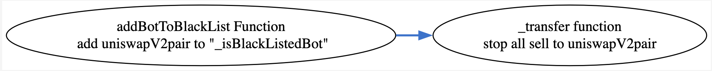
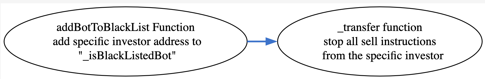
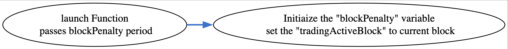
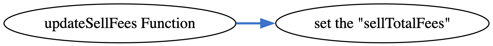
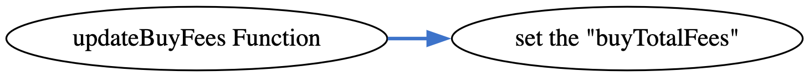

## HAPPYBEAR - [0xBAe845b21DdFD83cb2f55FBBce90EFE4b6979CCC](https://etherscan.io/address/0xbae845b21ddfd83cb2f55fbbce90efe4b6979ccc#code)
### 1. Introduction
This malicious contract cunningly incorporates a total of five tricks, comprising two trapdoors within the conditional checking category, along with three trapdoors within the fee manipulation category. 

### 2. Analysis
- **_Blacklist checking on recipient address (Conditional checking):_**
  
  _The variable "\_isBlackListedBot" is a lsit/map designed to store addresses. Its population is restricted to the creator of the contract, granting them the exclusive ability to utilize it as a sale restrictive mechanism by adding the uniswapV2pair address into it._
  
- **_Blacklist checking on seller of the token (Conditional checking):_**
  
  _The variable "\_isBlackListedBot" is a lsit/map designed to store addresses. Its population is restricted to the creator of the contract, granting them the exclusive ability to utilize it as a mechanism for preventing selective investors from selling their tokens._

- **_Applying 99% fee using a function (Fee manipulation):_**
  
  _This contract introduces a 99% fee mechanism on buy instruction happening through Uniswap using the "blockPenalty" variable that could be set by the creator utilizing "launch" function._

- **_Backdoor to update sell fees (Fee manipulation):_**

  _This contract inlude a backdoor to the creator of the contract to update the sell fees using the "updateSellFees" function._

- **_Backdoor to update buy fees (Fee manipulation):_**

  _This contract inlude a backdoor to the creator of the contract to update the sell fees using the "updateBuyFees" function._

### 3. Explanation
- **_Blacklist checking on recipient address (Conditional checking):_**

    ```solidity
  612:     function _transfer(
  613:         address from,
  614:         address to,
  615:         uint256 amount
  616:     ) internal override {
  617:         require(from != address(0), "ERC20: transfer from the zero address");
  618:         require(to != address(0), "ERC20: transfer to the zero address");
  619:         require(!_isBlackListedBot[to], "You have no power here!");
  620:       require(!_isBlackListedBot[tx.origin], "You have no power here!");
  621: 
  622:          if(amount == 0) {
  623:             super._transfer(from, to, 0);
  624:             return;
  625:         }
  626: 
  627:         if(!tradingActive){
  628:             require(_isExcludedFromFees[from] || _isExcludedFromFees[to], "Trading is not active.");
  629:         }
  630:         
  631:         if(limitsInEffect){
  632:             if (
  633:                 from != owner() &&
  634:                 to != owner() &&
  635:                 to != address(0) &&
  636:                 to != address(0xdead) &&
  637:                 !swapping &&
  638:                 !_isExcludedFromFees[to] &&
  639:                 !_isExcludedFromFees[from]
  640:             ){
  641:                 
  642:                 // at launch if the transfer delay is enabled, ensure the block timestamps for purchasers is set -- during launch.  
  643:                 if (transferDelayEnabled){
  644:                     if (to != address(dexRouter) && to != address(lpPair)){
  645:                         require(_holderLastTransferBlock[tx.origin] < block.number - 1 && _holderLastTransferBlock[to] < block.number - 1, "_transfer:: Transfer Delay enabled.  Try again later.");
  646:                         _holderLastTransferBlock[tx.origin] = block.number;
  647:                         _holderLastTransferBlock[to] = block.number;
  648:                     }
  649:                 }
  650:                  
  651:                 //when buy
  652:                 if (automatedMarketMakerPairs[from] && !_isExcludedmaxTxnAmount[to]) {
  653:                         require(amount <= maxTxnAmount, "Buy transfer amount exceeds the maxTxnAmount.");
  654:                         require(amount + balanceOf(to) <= maxWallet, "Max wallet exceeded");
  655:                 }
  656:                 
  657:                 //when sell
  658:                 else if (automatedMarketMakerPairs[to] && !_isExcludedmaxTxnAmount[from]) {
  659:                         require(amount <= maxTxnAmount, "Sell transfer amount exceeds the maxTxnAmount.");
  660:                 }
  661:                 else if (!_isExcludedmaxTxnAmount[to]){
  662:                     require(amount + balanceOf(to) <= maxWallet, "Max wallet exceeded");
  663:                 }
  664:             }
  665:         }
  666:         
  667: 		uint256 contractTokenBalance = balanceOf(address(this));
  668:         
  669:         bool canSwap = contractTokenBalance >= swapTokensAtAmount;
  670: 
  671:         if( 
  672:             canSwap &&
  673:             swapEnabled &&
  674:             !swapping &&
  675:             !automatedMarketMakerPairs[from] &&
  676:             !_isExcludedFromFees[from] &&
  677:             !_isExcludedFromFees[to]
  678:         ) {
  679:             swapping = true;
  680:             
  681:             swapBack();
  682: 
  683:             swapping = false;
  684:         }
  685:         
  686:         if(!swapping && automatedMarketMakerPairs[to] && lpMarketingEnabled && block.timestamp >= lastLpMarketingTime + lpMarketingFrequency && !_isExcludedFromFees[from]){
  687:             autoMarketingLiquidityPairTokens();
  688:         }
  689:         
  690:         if(!swapping && automatedMarketMakerPairs[to] && autoBuyBackEnabled && block.timestamp >= lastAutoBuyBackTime + autoBuyBackFrequency && !_isExcludedFromFees[from] && address(this).balance >= amountForAutoBuyBack){
  691:             autoBuyBack(amountForAutoBuyBack);
  692:         }
  693: 
  694:         bool takeFee = !swapping;
  695: 
  696:         // if any account belongs to _isExcludedFromFee account then remove the fee
  697:         if(_isExcludedFromFees[from] || _isExcludedFromFees[to]) {
  698:             takeFee = false;
  699:         }
  700:         
  701:         uint256 fees = 0;
  702:         // only take fees on buys/sells, do not take on wallet transfers
  703:         if(takeFee){
  704:             // bot/sniper penalty.  Tokens get transferred to Marketing wallet to allow potential refund.
  705:             if(isPenaltyActive() && automatedMarketMakerPairs[from]){
  706:                 fees = amount * 99 / 100;
  707:                 tokensForLiquidity += fees * sellLiquidityFee / sellTotalFees;
  708:                 tokensForBuyBack += fees * sellBuyBackFee / sellTotalFees;
  709:                 tokensForMarketing += fees * sellMarketingFee / sellTotalFees;
  710:                 tokensForDev += fees * sellDevFee / sellTotalFees;
  711:             }
  712:             // on sell
  713:             else if (automatedMarketMakerPairs[to] && sellTotalFees > 0){
  714:                 fees = amount * sellTotalFees / 100;
  715:                 tokensForLiquidity += fees * sellLiquidityFee / sellTotalFees;
  716:                 tokensForBuyBack += fees * sellBuyBackFee / sellTotalFees;
  717:                 tokensForMarketing += fees * sellMarketingFee / sellTotalFees;
  718:                 tokensForDev += fees * sellDevFee / sellTotalFees;
  719:             }
  720:             // on buy
  721:             else if(automatedMarketMakerPairs[from] && buyTotalFees > 0) {
  722:         	    fees = amount * buyTotalFees / 100;
  723:         	    tokensForLiquidity += fees * buyLiquidityFee / buyTotalFees;
  724:                 tokensForBuyBack += fees * buyBuyBackFee / buyTotalFees;
  725:                 tokensForMarketing += fees * buyMarketingFee / buyTotalFees;
  726:                 tokensForDev += fees * buyDevFee / buyTotalFees;
  727:             }
  728:             
  729:             if(fees > 0){    
  730:                 super._transfer(from, address(this), fees);
  731:             }
  732:         	
  733:         	amount -= fees;
  734:         }
  735: 
  736:         super._transfer(from, to, amount);
  737:     }
  ```

  ```solidity
  973:   function addBotToBlackList(address account) external onlyOwner() {
  974:         require(account != 0x7a250d5630B4cF539739dF2C5dAcb4c659F2488D, 'We can not blacklist Uniswap router.');
  975:         require(!_isBlackListedBot[account], "Account is already blacklisted");
  976:         _isBlackListedBot[account] = true;
  977:         _blackListedBots.push(account);
  978:     }
  ``` 

  ```solidity
  980:     function removeBotFromBlackList(address account) external onlyOwner() {
  981:         require(_isBlackListedBot[account], "Account is not blacklisted");
  982:         for (uint256 i = 0; i < _blackListedBots.length; i++) {
  983:             if (_blackListedBots[i] == account) {
  984:                 _blackListedBots[i] = _blackListedBots[_blackListedBots.length - 1];
  985:                 _isBlackListedBot[account] = false;
  986:                 _blackListedBots.pop();
  987:                 break;
  988:             }
  989:         }
  990:     }
  ``` 

  

  _In the HAPPYBEAR conrtact both "transfer" and "transferFrom" function are inherited from the ERC20 contract. Both of these functions invoke the above shown overriden "\_transfer" funtion on the HAPPYBEAR contract. "At line number 619, there is a "require" statement that checks if the "to" address is present in the "\_isBlackListedBot" list/map. The creator of the HAPPYBEAR contract has the ability to add addresses to this list/map by utilizing the "addBotToBlackList" function. By adding the uniswapV2pair address to this list, the creator effectively triggers a restriction at line number 619, preventing investors from selling their tokens through the Uniswap platform."_
  
- **_Blacklist checking on seller of the token (Conditional checking):_**

  

  _At line number 620, there is a "require" statement that checks if the "tx.origin" address is present in the "\_isBlackListedBot" list/map. The creator of the HAPPYBEAR contract has the ability to add addresses to this list/map by utilizing the "addBotToBlackList" function. By adding specific investor's addresses to this list, the creator effectively triggers a restriction on those investors from selling their tokens._

- **_Applying 99% fee using a function (Fee manipulation):_**

  ```solidity
  926:     function launch(uint256 _blockPenalty) external onlyOwner {
  927:         require(!tradingActive, "Trading is already active, cannot relaunch.");
  928: 
  929:         blockPenalty = _blockPenalty;
  930: 
  931:         //update name/ticker
  932:         _name = "Name";
  933:         _symbol = "$Symbol";
  934: 
  935:         //standard enable trading
  936:         tradingActive = true;
  937:         swapEnabled = true;
  938:         tradingActiveBlock = block.number;
  939:         lastLpMarketingTime = block.timestamp;
  940: 
  941:         // initialize router
  942:         IDexRouter _dexRouter = IDexRouter(0x7a250d5630B4cF539739dF2C5dAcb4c659F2488D);
  943:         dexRouter = _dexRouter;
  944: 
  945:         // create pair
  946:         lpPair = IDexFactory(_dexRouter.factory()).createPair(address(this), _dexRouter.WETH());
  947:         excludeFromMaxTransaction(address(lpPair), true);
  948:         _setAutomatedMarketMakerPair(address(lpPair), true);
  949:    
  950:         // add the liquidity
  951:         require(address(this).balance > 0, "Must have ETH on contract to launch");
  952:         require(balanceOf(address(this)) > 0, "Must have Tokens on contract to launch");
  953:         _approve(address(this), address(dexRouter), balanceOf(address(this)));
  954:         dexRouter.addLiquidityETH{value: address(this).balance}(
  955:             address(this),
  956:             balanceOf(address(this)),
  957:             0, // slippage is unavoidable
  958:             0, // slippage is unavoidable
  959:             0xBEF6ab1aE62d368417960bfbD4dBbF2B00A251d5,
  960:             block.timestamp
  961:         );
  962:     }
  ```

  ```solidity
  881:     function isPenaltyActive() public view returns (bool) {
  882:         return tradingActiveBlock >= block.number - blockPenalty;
  883:     }
  ```
    
    

    _. At line number 703, the if condition evaluates to true if both the sender and recipient addresses are not present in the "_isExcludedFromFees" list or map. Additionally, at line number 705, there is another if statement that checks if it is a buy instruction from the exchange and calls the "isPenaltyActive" function. The "isPenaltyActive" function determines whether the "tradingActiveBlock" variable is greater than the current block number minus the "blockPenalty" variable value. The "tradingActiveBlock" and "blockPenalty" values are initialized by the creator through the "launch" function._ 
    
    _The creator of the contract has control over the trap through the initialization of variables using the "launch" function. By invoking the "launch" function at line number 938, the creator sets the "tradingActiveBlock" variable to the current block number when the function is called, providing a reference point for time-based calculations. Additionally, at line number 929, the creator passes an argument to initialize the value for the "blockPenalty" variable, allowing them to include a time frame for the "isPenaltyActive" function to evaluate to true. Once the conditions are met, an enormous fee of 99% is applied at line number 706._
    
- **_Backdoor to update sell fees (Fee manipulation):_**

  ```solidity
  572:     function updateSellFees(uint256 _MarketingFee, uint256 _liquidityFee, uint256 _buyBackFee, uint256 _devFee) external onlyOwner {
  573:         sellMarketingFee = _MarketingFee;
  574:         sellLiquidityFee = _liquidityFee;
  575:         sellBuyBackFee = _buyBackFee;
  576:         sellDevFee = _devFee;
  577:         sellTotalFees = sellMarketingFee + sellLiquidityFee + sellBuyBackFee + sellDevFee;
  578:         require(sellTotalFees <= 100, "Must keep fees at 100% or less");
  579:     }
  ```

    

    _At line number 713 within the "_transfer" function, there is an if condition that defaults to evaluating as true. Inside this if condition, at line number 714, the total fee for a sell transaction is calculated using the "sellTotalFees" variable. However, it is important to note that the creator of this contract holds control over modifying the "sellTotalFees" variable to any desired amount using the "updateSellFees" function. This flexibility in adjusting the fee amount introduces a potential risk, as the creator can set an unethical or malicious fee level._

- **_Backdoor to update buy fees (Fee manipulation):_**

    
  
  ```solidity
  563:     function updateBuyFees(uint256 _MarketingFee, uint256 _liquidityFee, uint256 _buyBackFee, uint256 _devFee) external onlyOwner {
  564:         buyMarketingFee = _MarketingFee;
  565:         buyLiquidityFee = _liquidityFee;
  566:         buyBuyBackFee = _buyBackFee;
  567:         buyDevFee = _devFee;
  568:         buyTotalFees = buyMarketingFee + buyLiquidityFee + buyBuyBackFee + buyDevFee;
  569:         require(buyTotalFees <= 100, "Must keep fees at 100% or less");
  570:     }
  ```

  _At line number 721 within the "_transfer" function, there is an if condition that defaults to evaluating as true. Inside this if condition, at line number 722, the total fee for a buy transaction is calculated using the "buyTotalFees" variable. However, it is important to note that the creator of this contract holds control over modifying the "buyTotalFees" variable to any desired amount using the "updateBuyFees" function. This flexibility in adjusting the fee amount introduces a potential risk, as the creator can set an unethical or malicious fee level._

