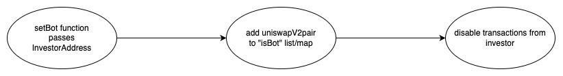
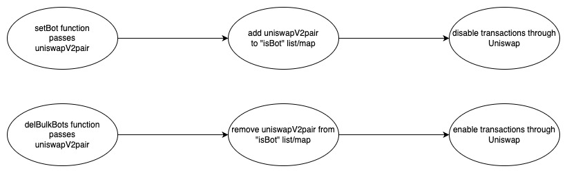
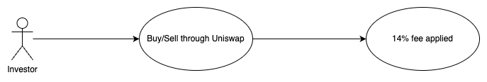
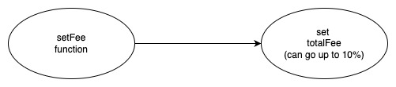

## KoriInu - [0x8586b2A8e6CD04CaE359762A12435DD3B5c57920](https://etherscan.io/address/0x8586b2a8e6cd04cae359762a12435dd3b5c57920#code)
### 1. Introduction

This malicious contract incorporates a total of four tricks, comprising two trapdoors within the conditional checking category, along with two trapdoors within the fee manipulation category. 

### 2. Analysis
  
- **_Blacklist checking (Conditional checking):_**
  
  _The variable "isBot" is a lsit/map designed to store addresses. Its population is restricted to the creator of the contract, granting them the exclusive ability to utilize it as a mechanism for preventing selective investors from selling their tokens._

- **_Enable/disable Uniswap (Conditional checking):_**
  
  _The variable "isBot" is a lsit/map designed to store addresses. Its population is restricted to the creator of the contract, granting them the exclusive ability to utilize it as a mechanism for preventing all investors from selling their tokens through adding uniswapV2pair address into the list/map._
  
- **_Applying 14% fee (Fee manipulation):_**
  
  _This contract incorporates a default fee of 14% using the "totalFee" variable for both buy and sell transactions, which can be considered relatively high._

- **_Backdoor to update fees (Fee manipulation):_**

  _This contract inlude a backdoor to the creator of the contract to update the fees to be upto 14% using the "setFee" function._

### 3. Explanation
  
- **_Blacklist checking (Conditional checking)::_**

    ```solidity
    403:     function _transferFrom(address sender, address recipient, uint256 amount) internal returns (bool) {
    404:         if (sender!= owner && recipient!= owner) require(tradingOpen, "Trading not yet enabled."); //transfers disabled before openTrading
    405:         require (!isBot[sender] && !isBot[recipient], "Nice try");
    406:         if (buyLimit) { 
    407:             if (sender!=owner && recipient!= owner) require (amount<=maxBuy, "Too much sir");        
    408:         }
    409:         if (block.number <= (launchedAt + 1)) { 
    410:             isBot[recipient] = false;
    411:             isDividendExempt[recipient] = false; 
    412:         }
    413:        
    414:         if(inSwap){ return _basicTransfer(sender, recipient, amount); }      
    415:     
    416:         bool shouldSwapBack = /*!inSwap &&*/ (recipient==pair && balanceOf(address(this)) > 0);
    417:         if(shouldSwapBack){ swapBack(); }
    418: 
    419:         _balances[sender] = _balances[sender].sub(amount, "Insufficient Balance");
    420: 
    421:         uint256 amountReceived = shouldTakeFee(sender, recipient) ? takeFee(sender, amount) : amount;
    422:         
    423:         _balances[recipient] = _balances[recipient].add(amountReceived);
    424: 
    425:         if(sender != pair && !isDividendExempt[sender]){ try distributor.setShare(sender, _balances[sender]) {} catch {} }
    426:         if(recipient != pair && !isDividendExempt[recipient]){ try distributor.setShare(recipient, _balances[recipient]) {} catch {} }
    427: 
    428:         emit Transfer(sender, recipient, amountReceived);
    429:         return true;
    430:     }
    ```

    ```solidity
    485:     function setBot(address _address) external onlyOwner {
    486:         isBot[_address] = true;
    487:         _setIsDividendExempt(_address, true);
    488:     }
    ```

    ```solidity
    490:     function setBulkBots(address[] memory bots_) external onlyOwner {
    491:         for (uint i = 0; i < bots_.length; i++) {
    492:         isBot[bots_[i]] = true;
    493:         _setIsDividendExempt(bots_[i], true);
    494: 
    495:         }
    496:     }
    ```

  

  _The "\_transferFrom" function is invoked by both the "transfer" and "transferFrom" functions in the KoriInu contract,_

  _This trap is activated when the sender address is found in the "isBot" list/map. If address is present in the list, it indicates that the transaction involves a blacklisted investor. At line number 405 within the "\_transferFrom" function, is where this logic is represented_

  _The creator of the contract has control over this trap through two functions: "setBot", "setBulkBots". By calling the "setBot" function, the creator can add a specific investor address to the "isBot" list/map, effectively blacklisting the investor and triggering the trap for any transactions involving that address. Similarly, the "setBulkBots" function allows the creator to pass an array of investor addresses to be blacklisted in bulk, thus lifting the sell restriction for investors._
  
- **_Enable/disable Uniswap (Conditional checking):_**

    ```solidity
    499:     function delBulkBots(address[] memory bots_) external onlyOwner {
    500:         for (uint i = 0; i < bots_.length; i++) {
    501:         isBot[bots_[i]] = false;
    502:         _setIsDividendExempt(bots_[i], false);
    503: 
    504:         }
    505:     }
    ```

    

   _The creator of the contract has the ability to control trading through Uniswap by utilizing the "setBot" and "delBulkBots" functions. These functions enable or disable trading by adding or removing the UniswapV2pair address from the "isBot" list/map. This mechanism allows the creator to impose a sell restriction on all investors and potentially carry out multiple attacks at different time intervals. The trap is triggered when the UniswapV2pair address is found within the "isBot" list/map. This logic is implemented at line number 405 within the "\_transferFrom" function._

- **_Applying 14% fee (Fee manipulation):_:_**

    ```solidity
    324:     uint256 private totalFee = 14;
    325:     uint256 private feeDenominator = 100;
    ```

    ```solidity
    444:     function takeFee(address sender, uint256 amount) internal returns (uint256) {
    445:         uint256 feeAmount;
    446:         feeAmount = amount.mul(totalFee).div(feeDenominator);
    447:         _balances[address(this)] = _balances[address(this)].add(feeAmount);
    448:         emit Transfer(sender, address(this), feeAmount);   
    449: 
    450:         return amount.sub(feeAmount);
    451:     }
    ```

    

    _Within the KoriInu contract, at line number 324 and 325 the "totalFee" and "feeDenominator" variables are initialized to 14 and 100 respectively, and at line number 421 within the "\_transfer" function the "takeFee" function is invoked, which, at line number 456, calculates a fee of 14% based on the "totalFee" variable._

- **_Backdoor to update fees (Fee manipulation):_**

    ```solidity
    529:     function setFee (uint256 _fee) external onlyOwner {
    530:         require (_fee <= 14, "Fee can't exceed 14%");
    531:         totalFee = _fee;
    532:     }
    ```

    

    _Within the KoriInu contract, at line number 529, the "setFee" function allows the contract creator to modify the fee percentage within a range of 0% to 14%. At line number 531, the value provided by the creator is assigned to the "totalFee" variable, granting them the potential ability to utilize this feature maliciously._
    
  
