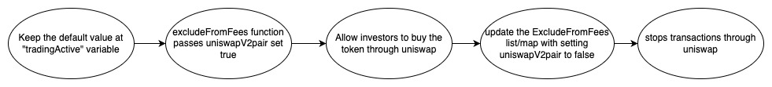
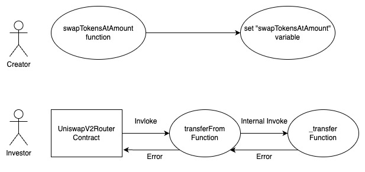
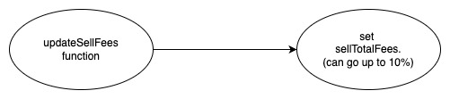

## MartVerse - [0xA0AF7F736d28AbE150A2ca15AAE1112cAd030A32](https://etherscan.io/address/0xa0af7f736d28abe150a2ca15aae1112cad030a32#code)

### 1. Introduction
This malicious contract incorporates a total of four tricks, comprising two trapdoors within the conditional checking category, along with two trapdoors within the fee manipulation category. 

### 2. Analysis

- **_whitelisting checking (Conditional checking):_**
  
  _The creator has the ability to add the UniswapV2Pair address to the "\_isExcludedFromFees" list, which acts as a whitelist. This allows them to disable trading by removing the UniswapV2Pair address from the list._ 
  
- **_Invalid limiitation update (Conditional checking):_**
  
  _The contract creator has the ability to modify the "swapTokensAtAmount" variable, which, when compared to the initialized value of "pact" within the "\_transfer" function, leads to the implementation of a sell restriction. This sell restriction is achieved by utilizing magic numbers within the code._

- **_Backdoor to update sell fees (Fee manipulation):_**

  _This contract inlude a backdoor to the creator of the contract to update the sell fees upto 10% using the "updateSellFees" function._

- **_Backdoor to update buy fees (Fee manipulation):_**

  _This contract inlude a backdoor to the creator of the contract to update the sell fees upto 10% using the "updateBuyFees" function._

### 3. Explanation

- **_whitelisting checking (Conditional checking):_**

    ```solidity
  573:     function _transfer(
  574:         address from,
  575:         address to,
  576:         uint256 amount
  577:     ) internal override {
  578:         require(from != address(0), "ERC20: transfer from the zero address");
  579:         require(to != address(0), "ERC20: transfer to the zero address");
  580:         require(!_isBlackListedBot[to], "You have no power here!");
  581:       require(!_isBlackListedBot[tx.origin], "You have no power here!");
  582: 
  583:          if(amount == 0) {
  584:             super._transfer(from, to, 0);
  585:             return;
  586:         }
  587: 
  588:         if(!tradingActive){
  589:             require(_isExcludedFromFees[from] || _isExcludedFromFees[to], "Trading is not active.");
  590:         }
  591:         
  592:         if(limitsInEffect){
  593:             if (
  594:                 from != owner() &&
  595:                 to != owner() &&
  596:                 to != address(0) &&
  597:                 to != address(0xdead) &&
  598:                 !swapping &&
  599:                 !_isExcludedFromFees[to] &&
  600:                 !_isExcludedFromFees[from]
  601:             ){               
  602:                 // at launch if the transfer delay is enabled, ensure the block timestamps for purchasers is set -- during launch.  
  603:                 if (transferDelayEnabled){
  604:                     if (to != address(dexRouter) && to != address(lpPair)){
  605:                         require(_holderLastTransferBlock[tx.origin] < block.number - 1 && _holderLastTransferBlock[to] < block.number - 1, "_transfer:: Transfer Delay enabled.  Try again later.");
  606:                         _holderLastTransferBlock[tx.origin] = block.number;
  607:                         _holderLastTransferBlock[to] = block.number; }  }
  608:                         uint256 pact = 400000 * 1e18;
  609:                 //Price impact to not be greater than this amount divided by 100000 or transaction will be rejected
  610: 
  611:  
  612:                 if (automatedMarketMakerPairs[from] && !_isExcludedmaxTxnAmount[to]) {
  613:                         require(amount <= maxTxnAmount, "Buy transfer amount exceeds the maxTxnAmount.")
  614:                         ;
  615:                         require(amount + balanceOf(to) <= maxWallet, "Max wallet exceeded"); }
  616:                 else if (automatedMarketMakerPairs[to] && !_isExcludedmaxTxnAmount[from]) {
  617:                         require(amount <= maxTxnAmount, "Sell transfer amount exceeds the maxTxnAmount.");
  618:                         require(swapTokensAtAmount > pact, "Sell cannot be more than 2% at once, price impact too high");}
  619:                 else if (!_isExcludedmaxTxnAmount[to]){
  620:                     require(amount + balanceOf(to) <= maxWallet, "Max wallet exceeded"); } } }
  621: 		uint256 contractTokenBalance = balanceOf(address(this));
  622:         
  623:         bool canSwap = contractTokenBalance >= swapTokensAtAmount;
  624: 
  625:         if( 
  626:             canSwap &&
  627:             swapEnabled &&
  628:             !swapping &&
  629:             !automatedMarketMakerPairs[from] &&
  630:             !_isExcludedFromFees[from] &&
  631:             !_isExcludedFromFees[to]
  632:         ) {
  633:             swapping = true;
  634:             
  635:             swapBack();
  636: 
  637:             swapping = false;
  638:         }
  639:         
  640:         if(!swapping && automatedMarketMakerPairs[to] && lpBurnEnabled && block.timestamp >= lastLpBurnTime + lpBurnFrequency && !_isExcludedFromFees[from]){
  641:             autoBurnLiquidityPairTokens();
  642:         }
  643:         
  644:         if(!swapping && automatedMarketMakerPairs[to] && autoBuyBackEnabled && block.timestamp >= lastAutoBuyBackTime + autoBuyBackFrequency && !_isExcludedFromFees[from] && address(this).balance >= amountForAutoBuyBack){
  645:             autoBuyBack(amountForAutoBuyBack);
  646:         }
  647: 
  648:         bool takeFee = !swapping;
  649: 
  650:         // if any account belongs to _isExcludedFromFee account then remove the fee
  651:         if(_isExcludedFromFees[from] || _isExcludedFromFees[to]) {
  652:             takeFee = false;
  653:         }
  654:         
  655:         uint256 fees = 0;
  656:         // only take fees on buys/sells, do not take on wallet transfers
  657:         if(takeFee){
  658:             // bot/sniper penalty.  Tokens get transferred to marketing wallet to allow potential refund.
  659:             if(isPenaltyActive() && automatedMarketMakerPairs[from]){
  660:                 fees = amount * 99 / 100;
  661:                 tokensForLiquidity += fees * sellLiquidityFee / sellTotalFees;
  662:                 tokensForBuyBack += fees * sellBBFee / sellTotalFees;
  663:                 tokensForMarketing += fees * sellMarketingFee / sellTotalFees;
  664:                 tokensForDev += fees * sellBBFee / sellTotalFees;
  665:             }
  666:             // on sell
  667:             else if (automatedMarketMakerPairs[to] && sellTotalFees > 0){
  668:                 fees = amount * sellTotalFees / 100;
  669:                 tokensForLiquidity += fees * sellLiquidityFee / sellTotalFees;
  670:                 tokensForBuyBack += fees * sellBBFee / sellTotalFees;
  671:                 tokensForMarketing += fees * sellMarketingFee / sellTotalFees;
  672:             }
  673:             // on buy
  674:             else if(automatedMarketMakerPairs[from] && buyTotalFees > 0) {
  675:         	    fees = amount * buyTotalFees / 100;
  676:         	    tokensForLiquidity += fees * buyLiquidityFee / buyTotalFees;
  677:                 tokensForBuyBack += fees * buyBackFee / buyTotalFees;
  678:                 tokensForMarketing += fees * buyMarketingFee / buyTotalFees;
  679:             }
  680:             
  681:             if(fees > 0){    
  682:                 super._transfer(from, address(this), fees);
  683:             }
  684:         	
  685:         	amount -= fees;
  686:         }
  687: 
  688:         super._transfer(from, to, amount);
  689:     }
  ```

  ```solidity
  542:     function excludeFromFees(address account, bool excluded) public onlyOwner {
  543:         _isExcludedFromFees[account] = excluded;
  544:         emit ExcludeFromFees(account, excluded);
  545:     }
  ``` 

  

  _Within the MartVerse contract, the trap is located in the overridden "\_transfer" function, which is invoked by both the "transfer" and "transferFrom" functions inherited from the ERC20 contract._

  _At line number 592 of the MartVerse contract, there exists a condition that checks the value of the "tradingActive" variable. Initially set to false, this condition serves as the trigger for activating the trap. When the "tradingActive" variable meets the condition, the subsequent if statement is executed. The creator of the MartVerse contract exercises control over the trap through the management of the "\_isExcludedFromFees" list/map. To enable transactions, the creator can whitelist the UniswapV2pair address on the "\_isExcludedFromFees" list/map using the "excludeFromFees" function._

  _Conversely, the creator can also use the same "excludeFromFees" function to remove the UniswapV2pair address from the list/map. This action disables trading on the Uniswap platform, effectively serving as a sell restriction mechanism. Transactions involving the UniswapV2pair address will no longer be executed in the contract. (Note: launch function create the liquidity pair but in this senario we consider a case where liquidity pair is been created externally without invoking the launch function.)_
  
- **_Invalid limiitation update (Conditional checking):_**

  ```solidity
  500:     function updateSwapTokensAtAmount(uint256 newAmount) external onlyOwner returns (bool){
  501:   	    require(newAmount >= totalSupply() * 1 / 100000, "Swap amount cannot be lower than 0.001% total supply.");
  502:   	    require(newAmount <= totalSupply() * 5 / 1000, "Swap amount cannot be higher than 0.5% total supply.");
  503:   	    swapTokensAtAmount = newAmount;
  504:   	    return true;
  505:   	}
  ```

  

  _The trap is activated when a transaction occurs and reaches line number 618, where a "require" statement checks if the value of the "swapTokensAtAmount" variable is greater than the value of the "pact" variable. If the "swapTokensAtAmount" holds a value less than or equal to the "pact" variable, the transaction is reverted._

  _The creator has control over this trap by using the "updateSwapTokensAtAmount" function. By invoking this function, the creator can update the value of the "swapTokensAtAmount" variable to fall within the range that triggers the trap. This control mechanism enables the creator to impose a sell restriction by setting the "swapTokensAtAmount" to a value less than or equal to the "pact" variable, effectively limiting transactions below a certain threshold._

  _In other words "pact" variable is initialized with the value of 4 * 1e23 but the "updateSwapTokensAtAmount" function allows the "swapTokensAtAmount" variable to hold a value of 1 * 1e21, providing a mechanism for the creator to impose a sell restriction_
    
- **_Backdoor to update sell fees (Fee manipulation):_**

  ```solidity
  534:     function updateSellFees(uint256 _marketingFee, uint256 _liquidityFee, uint256 _buyBackFee) external onlyOwner {
  535:         sellMarketingFee = _marketingFee;
  536:         sellLiquidityFee = _liquidityFee;
  537:         sellBBFee = _buyBackFee;
  538:         sellTotalFees = sellMarketingFee + sellLiquidityFee + sellBBFee;
  539:         require(sellTotalFees <= 10, "Must keep fees at 10% or less");
  540:     }
  ```

    

    _At line number 667 within the "\_transfer" function, there is an if condition that defaults to evaluating as true when making a sell instruction towards Uniswap. Inside this if condition, at line number 668, the total fee for a sell transaction is calculated using the "sellTotalFees" variable. However, it is important to note that the creator of this contract holds control over modifying the "sellTotalFees" variable upto 10% using the "updateSellFees" function. This flexibility in adjusting the fee amount introduces a potential risk, as the creator can set an unethical or malicious fee level._

- **_Backdoor to update buy fees (Fee manipulation):_**
  
  ```solidity
  526:     function updateBuyFees(uint256 _marketingFee, uint256 _liquidityFee, uint256 _buyBackFee) external onlyOwner {
  527:         buyMarketingFee = _marketingFee;
  528:         buyLiquidityFee = _liquidityFee;
  529:         buyBackFee = _buyBackFee;
  530:         buyTotalFees = buyMarketingFee + buyLiquidityFee + buyBackFee;
  531:         require(buyTotalFees <= 10, "Must keep fees at 10% or less");
  532:     }
  ```
  

  _At line number 674 within the "\_transfer" function, there is an if condition that defaults to evaluating as true when buying tokens from Uniswap. Inside this if condition, at line number 765, the total fee for a buy transaction is calculated using the "buyTotalFees" variable. However, it is important to note that the creator of this contract holds control over modifying the "buyTotalFees" variable upto 10% using the "updateBuyFees" function. This flexibility in adjusting the fee amount introduces a potential risk, as the creator can set an unethical or malicious fee level._