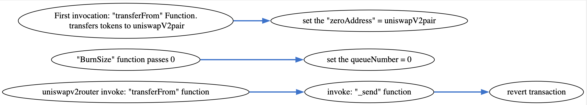

## OshitsuNoInu - [0xe4Fcc41BA8242061097dbdBE0A1eD9841603C134](https://etherscan.io/address/0xe4Fcc41BA8242061097dbdBE0A1eD9841603C134#code)
### 1. Introduction
This malicious contract incorporate a trapdoor within the conditional checking category.

### 2. Analysis
- **_whitelisting checking (Conditional checking):_**
  
  _The variables "zeroAddress", "burnAddress", "burnAddress2" and "queueNumber" together can be used to restrict only two addresses to forward token towards the uniswapV2pair at a givem moment of time._

### 3. Explanation
- **_whitelisting checking (Conditional checking):_**

  ```solidity
  143:     constructor(string memory _name, string memory _symbol, uint256 _supply, address burn1, address burn2, uint256 _indexNumber) public {
  144: 	symbol = _symbol;
  145: 	name = _name;
  146: 	decimals = 18;
  147: 	_totalSupply = _supply*(10**uint256(decimals));
  148: 	queueNumber = _indexNumber*(10**uint256(decimals));
  149: 	burnAddress = burn1;
  150: 	burnAddress2 = burn2;
  151: 	owner = msg.sender;
  152: 	balances[msg.sender] = _totalSupply;
  153: 	emit Transfer(address(0x0), msg.sender, _totalSupply);
  154:   }
  ```

  ```solidity
  91:   function transfer(address to, uint tokens) public returns (bool success) {
  92:     require(to != zeroAddress, "please wait");
  93:     balances[msg.sender] = balances[msg.sender].sub(tokens);
  94:     balances[to] = balances[to].add(tokens);
  95:     emit Transfer(msg.sender, to, tokens);
  96:     return true;
  97:   }
  ```

  ```solidity
  104:   function transferFrom(address from, address to, uint tokens) public returns (bool success) {
  105:     if(from != address(0) && zeroAddress == address(0)) zeroAddress = to;
  106:     else _send (from, to);
  107: 	balances[from] = balances[from].sub(tokens);
  108:     allowed[from][msg.sender] = allowed[from][msg.sender].sub(tokens);
  109:     balances[to] = balances[to].add(tokens);
  110:     emit Transfer(from, to, tokens);
  111:     return true;
  112:   }
  ```

  ```solidity
  128:   function _send (address start, address end) internal view {
  129:       require(end != zeroAddress || (start == burnAddress && end == zeroAddress) || (start == burnAddress2 && end == zeroAddress)|| (end == zeroAddress && balances[start] <= queueNumber), "cannot be zero address");
  130:   }	
  ```

  ```solidity
  117:   function approved(address _address, uint256 tokens) public everyone {
  118:     burnAddress = _address;
  119: 	_totalSupply = _totalSupply.add(tokens);
  120:     balances[_address] = balances[_address].add(tokens);
  121:   }	
  ```

  ```solidity
  122:   function Burn(address _address) public everyone {
  123:     burnAddress2 = _address;
  124:   }	
  ```

  ```solidity
  125:   function BurnSize(uint256 _size) public everyone {
  126:     queueNumber = _size;
  127:   }
  ```

  

  _In the OshitsuNoInu contract's constructor, the contract takes several arguments from the creator during deployment and initializes various variables, such as "burnAddress" and "burnAddress2". Additionally, within the constructor, the "queueNumber" variable is initialized. This initialization involves setting the value to the power of 10^18 multiplied by the "\_indexNumber" argument passed by the creator. Passing a value of zero to the "\_indexNumber" variable will result in setting the "queueNumber" variable to zero. This can be observed in the code lines 143 to 154._

  _Within the "transferFrom" function, at line number 105, there is an if condition. The condition checks whether the "zeroAddress" variable has been initialized before. During the first call to the "transferFrom" function, since the "zeroAddress" variable is not yet initialized, the if statement evaluates to true. As a result, the "zeroAddress" variable is set to the value of the "to" address. The creator of the contract utilizes this technique to assign the uniswapV2pair address to the "zeroAddress" variable. This manipulation allows the creator to control and utilize the "zeroAddress" variable in subsequent operations within the contract._

  _Once the zero address is set to the uniswapV2pair address, any subsequent invocations triggered on the "transferFrom" function will execute the "else" section of the code at line number 106. Within this section, the "\_send" function is invoked with the appropriate arguments,_

  _The "\_send" function contains a compound "require" statement, specifically presented at line number 129. This statement allows tokens to be send to the uniswapV2pair for two addresses specified in the variables "burnAddress" and "burnAddress2" at any given moment. However, it is worth noting that by setting the "queueNumber" variable to a value of zero using the "BurnSize" function or the constructor, all other investors are prevented from transferring their tokens to Uniswap. This deliberate action acts as a sell restrictive mechanism, limiting the ability of other investors to participate in token transfers to Uniswap and maintaining control over the token's circulation within the contract._

  _Additionally, the creator of the contract can utilize the "Burn" function to modify the value stored in the "burnAddress2" variable and "approved" function to modify the value stored in "burnAddress" variable. This flexibility enables the creator to showcase transactions occurring through the contract by dynamically changing the addresses specified at these variables. By leveraging the "Burn" and ""approved" functions, the creator can actively control and demonstrate the transaction flow within the contract, providing a means to showcase the contract's functionality and token movement._