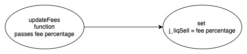

## Shakti - [0xa027EB7D1F17A6F888A504c5fb32fE42e0D07D8E](https://etherscan.io/address/0xa027eb7d1f17a6f888a504c5fb32fe42e0d07d8e#code)
### 1. Introduction
This malicious contract incorporates a trapdoor cleverly disguised within the conditional checking category. 

### 2. Analysis

- **_Creator updating the sell fee amount (Fee manipulation):_**
  
  _This contract includes a backdoor that allows the creator to update the sell fee amount by modifying the value at "j\_liqSell" using the "updateFees" function._

### 3. Explanation

- **_Creator updating the sell fee amount (Fee manipulation):_**

    ```solidity
    284:     function _transfer(address from, address to, uint256 amount) private {
    285: 
    286:         require(from != address(0), "ERC20: transfer from the zero address");
    287:         require(to != address(0), "ERC20: transfer to the zero address");
    288:         require(amount > 0, "Transfer amount must be greater than zero");
    289:         require(!bots[from] && !bots[to]);
    290: 
    291:         bool takeFee = true;
    292: 
    293:         if (from != owner() && to != owner() && from != address(this) && to != address(this)) {
    294: 
    295:             if (from == uniswapV2Pair && to != address(uniswapV2Router) && ((!_isExcludedFromFee[from] || !_isExcludedFromFee[to]))) {
    296:                 require(balanceOf(to).add(amount) <= _maxWalletAmount, "wallet balance after transfer must be less than max wallet amount");
    297:                 
    298:             }
    299: 
    300:             if (from == uniswapV2Pair && to != address(uniswapV2Router) && !bots[to] && !bots[from]) {
    301:                 j_liqFee = j_liqBuy;
    302:                 j_burnFee = j_burnBuy;
    303:             }
    304:                 
    305:             if (to == uniswapV2Pair && from != address(uniswapV2Router) && !bots[to] && !bots[from]) {
    306:                 j_liqFee = j_liqSell;
    307:                 j_burnFee = j_burnSell;
    308:             }
    309:            
    310:             if (!swapping && from != uniswapV2Pair) {
    311: 
    312:                 uint256 contractTokenBalance = balanceOf(address(this));
    313: 
    314:                 if (contractTokenBalance > swapAmount) {
    315:                     swapAndLiquify(contractTokenBalance);
    316:                 }
    317: 
    318:                 //uint256 contractETHBalance = address(this).balance;
    319:                 //if (contractETHBalance > 0) {
    320:                 //    sendETHToFee(address(this).balance);
    321:                 //}
    322:                     
    323:             }
    324:         }
    325: 
    326:         if (_isExcludedFromFee[from] || _isExcludedFromFee[to]) {
    327:             takeFee = false;
    328:         }
    329:         
    330:         _transferAgain(from, to, amount, takeFee);
    331:         restoreAllFee();
    332:     }
    ```

    ```solidity
    272:     function updateFees(uint256 liqSell) external onlyOwner {
    273:         j_liqSell = liqSell;
    274:         
    275:     }
    ``` 

    ```solidity
    162:     uint256 public j_liqSell = 2; 
    163:     uint256 public j_burnSell = 1; 
    ``` 

  

    _The "\_transfer" function is invoked by both the "transfer" and "transferFrom" functions in the Shakti contract,_
    
    _At line number 306 within the "\_transfer" function, the percentage of the sell fee is extracted and stored in the variable "j\_liqFee" from the variable "j\_liqSell." This line is executed when tokens move from an investor towards Uniswap during a sell transaction._

    _At line number 162 within the Shakti contract, the variable "j\_liqSell" is initialized with a value of 2._

    _The creator of the contract has full control over this trap. By using the "updateJLiqSell" function, they can modify the value of the "j\_liqSell" variable. This manipulation allows the creator to adjust the sell fee percentage,_