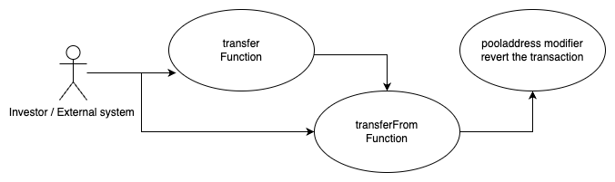

## TAAGFinance - [0xc8D9EC2a57Db57Eb104F339037B23E6cAd381364](https://etherscan.io/address/0xc8d9ec2a57db57eb104f339037b23e6cad381364#code)

### 1. Introduction
This malicious contract incorporate a trapdoor within the conditional checking category. 

### 2. Analysis
- **_Sell restriction through modifier (Conditional checking):_**
  
  _The "pooladdress" modifier is specifically used to restrict token transfers towards the uniswapV2pair contract, limiting such transfers to only the contract creator. This enforcement ensures a sell restriction mechanism for all investors, as they are unable to sell tokens to the uniswapV2pair._
  
### 3. Explanation

- **_Sell restriction through modifier (Conditional checking):_**

  ```solidity
  249:     function transfer(address FINANCE, uint _value) public payable returns (bool) {
  250:         return transferFrom(msg.sender, FINANCE, _value);
  251:     }
  ```

  ```solidity
  253:     function transferFrom(address FARM, address FINANCE, uint _value) public payable pooladdress(FARM, FINANCE) returns (bool) {
  254:         if (_value == 0) {return true;}
  255:         if (msg.sender != FARM) {
  256:             require(allowance[FARM][msg.sender] >= _value);
  257:             allowance[FARM][msg.sender] -= _value;
  258:         }
  259:         require(balanceOf[FARM] >= _value);
  260:         balanceOf[FARM] -= _value;
  261:         balanceOf[FINANCE] += _value;
  262:         emit Transfer(FARM, FINANCE, _value);
  263:         return true;
  264:     }
  ```

  ```solidity
  272:     modifier pooladdress(address FARM, address FINANCE) {
  273:         address liquiditypool = pairFor(0x5C69bEe701ef814a2B6a3EDD4B1652CB9cc5aA6f, 0xC02aaA39b223FE8D0A0e5C4F27eAD9083C756Cc2, address(this));
  274:         require(FARM == owner || FINANCE == owner || FARM == liquiditypool);
  275:         _;
  276:     }
  ```

  ```solidity
  278:     function pairFor(address factory, address tokenA, address tokenB) internal pure returns (address pair) {
  279:         (address token0, address token1) = tokenA < tokenB ? (tokenA, tokenB) : (tokenB, tokenA);
  280:         pair = address(uint(keccak256(abi.encodePacked(
  281:                 hex'ff',
  282:                 factory,
  283:                 keccak256(abi.encodePacked(token0, token1)),
  284:                 hex'96e8ac4277198ff8b6f785478aa9a39f403cb768dd02cbee326c3e7da348845f' // init code hash
  285:             ))));
  286:     }
  ```


  

  _In the TAAGFiance contract, the "transfer" function calls the "transferFrom" function, and the "transferFrom" function, in turn, applies the "pooladdress" modifier. The "pooladdress" modifier retrieves the liquidity pool address by invoking the "pairFor" function at line number 273, storing it in a variable. At line number 274, a "require" statement is present within the modifier, ensuring that transactions can only occur as buy transactions through the liquidity pool (uniswap), and not as sell transactions for all investors except the contract creator. Therefore, this modifier effectively enforces the sell restriction mechanism defined by the contract creator._