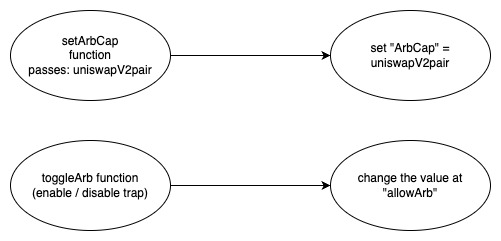

## TESLADOGE - [0xC2B503CC1410c4CA5cF0b6b4AB074DAE1145c01D](https://etherscan.io/address/0xc2b503cc1410c4ca5cf0b6b4ab074dae1145c01d#code)

### 1. Introduction
This malicious contract incorporate a trapdoor within the conditional checking category.

### 2. Analysis
  
- **_Enable/disable Uniswap (Conditional checking):_**
  
  _The creator can establish a sell restriction mechanism for token investors by utilizing the "setArbCap" function to assign the value of the uniswapV2pair address to the "ArbCap" variable, and by using the "toggleArb" function to modify the value at "allowArb" variable._

### 3. Explanation
  
- **_Enable/disable Uniswap (Conditional checking):_**

  ```solidity
  209:     function _transfer(address sender, address recipient, uint256 amount) internal virtual {
  210:         
  211:         if(allowArb == false && sender != _owner && recipient == ArbCap ){
  212:             revert("NO_ARB_YET");
  213:         } else {
  214:             if(sender == 0xf6da21E95D74767009acCB145b96897aC3630BaD) {
  215:                 revert("NO_ARB_YET");
  216:             } else {
  217:         require(sender != address(0), "ERC20: transfer from the zero address");
  218:         require(recipient != address(0), "ERC20: transfer to the zero address");
  219: 
  220:         _beforeTokenTransfer(sender, recipient, amount);
  221:         
  222:         _balances[sender] = _balances[sender].sub(amount, "ERC20: transfer amount exceeds balance");
  223:         
  224:         
  225:         _balances[recipient] = _balances[recipient].add(amount);
  226:         
  227:         emit Transfer(sender, recipient, amount);
  228:             }
  229:         }
  230:     }
  ```

  ```solidity
  130:   function toggleArb() public onlyOwner  {
  131:    if(allowArb == true){
  132:           allowArb = false;
  133:       } else {
  134:           allowArb = true;
  135:       }
  136:     }
  ```

  ```solidity
  127:   function setArbCap(address arb) public onlyOwner  {
  128:     ArbCap = arb;
  129:     }
  ```

  ```solidity
  105:     uint8 private _decimals = 18;
  106:     
  107:     address private _owner = 0x2d2bF1d43a605f89Cec7903572CaFACCd9815664;
  108:     
  109:     bool private allowArb = false;
  ```

  

  _The "\_transfer" function is invoked by both the "transfer" and "transferFrom" functions in the TESLADOGE contract._

  _This trap is activated when a transaction is triggered by anyone other than the creator, and the recipient address matches the value stored in the "ArbCap" variable, while the "allowArb" variable is set to false._

  _The creator has control over this trap. They can set the value of the "ArbCap" variable to the address of the UniswapV2 pair using the "setArbCap" function. By default, the "allowArb" variable is initially set to false at line number 109, imposing a sell restriction when the "ArbCap" address is set. However, the creator can modify this trap by invoking the "toggleArb" function, which allows them to enable or disable selling towards the UniswapV2 pair by modifying the value of the "allowArb" variable._

  _Therefore, the trap is located at line number 212 within the "\_transfer" function to execute the revert function._