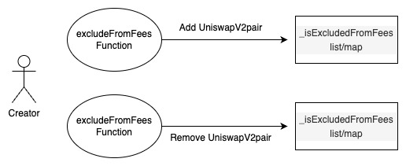
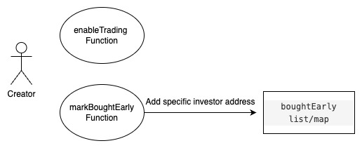
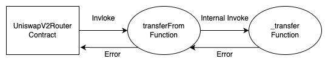
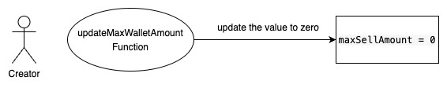
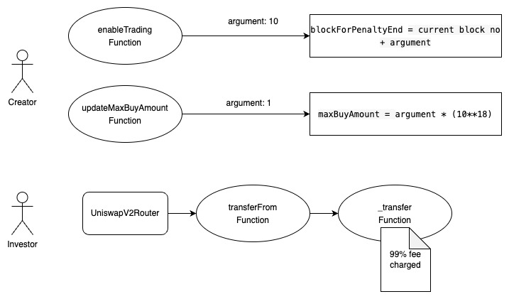

## TrustAI - [0x180d6c062b29bb2f4614a609ba0eb30ff1278b6b](https://etherscan.io/address/0x180d6c062b29bb2f4614a609ba0eb30ff1278b6b#code)
### 1. Introduction
This malicious contract incorporates a total of six tricks, comprising five trapdoors within the conditional checking category, along with one trapdoor within the fee manipulation category. 

### 2. Analysis
  
- **_whitelisting checking (Conditional checking):_**
  
  _The creator has the ability to add the UniswapV2Pair address to the "\_isExcludedFromFees" list, which acts as a whitelist. This allows them to disable trading by removing the UniswapV2Pair address from the list._ 
  
- **_Blacklist checking (Conditional checking):_**
  
  _The variable "boughtEarly" is a lsit/map designed to store addresses. Its population is restricted to the creator of the contract, granting them the exclusive ability to utilize it as a mechanism for preventing selective investors from selling their tokens._
  
- **_Default disabled selling on Uniswap (Conditional checking):_**
  
  _The variable "sellingEnabled" by default is set to false. This result in stopping all investors from selling their tokens through Uniswap exchange from the contract deployment time._
  
- **_invalid limitation update from creator (Conditional checking):_**
  
  _The variable "maxSellAmount" can be modified by the contract creator to the value of zero. This action effectively halts token transactions from investors._

- **_Default 10% fee and a special 99% fee (Fee manipulation):_**
  
  _This contract incorporates a default fee of 10% for both buy and sell transactions. Additionally, there is a specific malicious pathway that, upon invoking the "enableTrading" function by the creator, temporarily applies a fee of 99% for a short period of time._

### 3. Explanation
- **_whitelisting checking (Conditional checking):_**

    ```solidity
    647:     function _transfer(
    648:         address from,
    649:         address to,
    650:         uint256 amount
    651:     ) internal override {
    652:         require(from != address(0), "ERC20: transfer from the zero address");
    653:         require(to != address(0), "ERC20: transfer to the zero address");
    654:         require(amount > 0, "amount must be greater than 0");
    655: 
    656:         if (!tradingActive) {
    657:             require(
    658:                 _isExcludedFromFees[from] || _isExcludedFromFees[to],
    659:                 "Trading is not active."
    660:             );
    661:         }
    662: 
    663:         if (!earlyBuyPenaltyInEffect() && tradingActive) {
    664:             require(
    665:                 !boughtEarly[from] || to == owner() || to == address(0xdead),
    666:                 "Bots cannot transfer tokens in or out except to owner or dead address."
    667:             );
    668:         }
    669: 
    670:         if (limitsInEffect) {
    671:             if (
    672:                 from != owner() &&
    673:                 to != owner() &&
    674:                 to != address(0xdead) &&
    675:                 !_isExcludedFromFees[from] &&
    676:                 !_isExcludedFromFees[to]
    677:             ) {
    678:                 if (transferDelayEnabled) {
    679:                     if (to != address(dexRouter) && to != address(lpPair)) {
    680:                         require(
    681:                             _holderLastTransferTimestamp[tx.origin] <
    682:                                 block.number - 2 &&
    683:                                 _holderLastTransferTimestamp[to] <
    684:                                 block.number - 2,
    685:                             "_transfer:: Transfer Delay enabled.  Try again later."
    686:                         );
    687:                         _holderLastTransferTimestamp[tx.origin] = block.number;
    688:                         _holderLastTransferTimestamp[to] = block.number;
    689:                     }
    690:                 }
    691: 
    692:                 //when buy
    693:                 if (
    694:                     automatedMarketMakerPairs[from] &&
    695:                     !_isExcludedMaxTransactionAmount[to]
    696:                 ) {
    697:                     require(
    698:                         amount <= maxBuyAmount,
    699:                         "Buy transfer amount exceeds the max buy."
    700:                     );
    701:                     require(
    702:                         amount + balanceOf(to) <= maxWallet,
    703:                         "Max Wallet Exceeded"
    704:                     );
    705:                 }
    706:                 //when sell
    707:                 else if (
    708:                     automatedMarketMakerPairs[to] &&
    709:                     !_isExcludedMaxTransactionAmount[from]
    710:                 ) {
    711:                     require(sellingEnabled, "Selling disabled");
    712:                     require(
    713:                         amount <= maxSellAmount,
    714:                         "Sell transfer amount exceeds the max sell."
    715:                     );
    716:                 } else if (!_isExcludedMaxTransactionAmount[to]) {
    717:                     require(
    718:                         amount + balanceOf(to) <= maxWallet,
    719:                         "Max Wallet Exceeded"
    720:                     );
    721:                 }
    722:             }
    723:         }
    724: 
    725:         uint256 contractTokenBalance = balanceOf(address(this));
    726: 
    727:         bool canSwap = contractTokenBalance >= swapTokensAtAmount;
    728: 
    729:         if (
    730:             canSwap && swapEnabled && !swapping && automatedMarketMakerPairs[to]
    731:         ) {
    732:             swapping = true;
    733:             swapBack();
    734:             swapping = false;
    735:         }
    736: 
    737:         bool takeFee = true;
    738:         // if any account belongs to _isExcludedFromFee account then remove the fee
    739:         if (_isExcludedFromFees[from] || _isExcludedFromFees[to]) {
    740:             takeFee = false;
    741:         }
    742: 
    743:         uint256 fees = 0;
    744:         // only take fees on buys/sells, do not take on wallet transfers
    745:         if (takeFee) {
    746:             // bot/sniper penalty.
    747:             if (
    748:                 (earlyBuyPenaltyInEffect() ||
    749:                     (amount >= maxBuyAmount - .9 ether &&
    750:                         blockForPenaltyEnd + 8 >= block.number)) &&
    751:                 automatedMarketMakerPairs[from] &&
    752:                 !automatedMarketMakerPairs[to] &&
    753:                 !_isExcludedFromFees[to] &&
    754:                 buyTotalFees > 0
    755:             ) {
    756:                 if (!earlyBuyPenaltyInEffect()) {
    757:                     // reduce by 1 wei per max buy over what Uniswap will allow to revert bots as best as possible to limit erroneously blacklisted wallets. First bot will get in and be blacklisted, rest will be reverted (*cross fingers*)
    758:                     maxBuyAmount -= 1;
    759:                 }
    760: 
    761:                 if (!boughtEarly[to]) {
    762:                     boughtEarly[to] = true;
    763:                     botsCaught += 1;
    764:                     earlyBuyers.push(to);
    765:                     emit CaughtEarlyBuyer(to);
    766:                 }
    767: 
    768:                 fees = (amount * 99) / 100;
    769:                 tokensForLiquidity += (fees * buyLiquidityFee) / buyTotalFees;
    770:                 tokensForOperations += (fees * buyOperationsFee) / buyTotalFees;
    771:             }
    772:             // on sell
    773:             else if (automatedMarketMakerPairs[to] && sellTotalFees > 0) {
    774:                 fees = (amount * sellTotalFees) / 100;
    775:                 tokensForLiquidity += (fees * sellLiquidityFee) / sellTotalFees;
    776:                 tokensForOperations +=
    777:                     (fees * sellOperationsFee) /
    778:                     sellTotalFees;
    779:             }
    780:             // on buy
    781:             else if (automatedMarketMakerPairs[from] && buyTotalFees > 0) {
    782:                 fees = (amount * buyTotalFees) / 100;
    783:                 tokensForLiquidity += (fees * buyLiquidityFee) / buyTotalFees;
    784:                 tokensForOperations += (fees * buyOperationsFee) / buyTotalFees;
    785:             }
    786: 
    787:             if (fees > 0) {
    788:                 super._transfer(from, address(this), fees);
    789:             }
    790: 
    791:             amount -= fees;
    792:         }
    793: 
    794:         super._transfer(from, to, amount);
    795:     }
    ```

    ```solidity
    642:     function excludeFromFees(address account, bool excluded) public onlyOwner {
    643:         _isExcludedFromFees[account] = excluded;
    644:         emit ExcludeFromFees(account, excluded);
    645:     }
     ``` 

  

  _Within the TrustAI contract, the trap is located in the overridden "\_transfer" function, which is invoked by both the "transfer" and "transferFrom" functions inherited from the ERC20 contract._

  _At line number 657 of the TrustAI contract, there exists a condition that checks the value of the "tradingActive" variable. Initially set to false, this condition serves as the trigger for activating the trap. When the "tradingActive" variable meets the condition, the subsequent if statement is executed. The creator of the TrustAI contract exercises control over the trap through the management of the "\_isExcludedFromFees" list. To enable transactions, the creator can whitelist the UniswapV2pair address on the "\_isExcludedFromFees" list using the "excludeFromFees" function._

  _Conversely, the creator can also use the same "excludeFromFees" function to remove the UniswapV2pair address from the list. This action disables trading on the Uniswap platform, effectively serving as a sell restriction mechanism. Transactions involving the UniswapV2pair address will no longer be executed in the contract_
  
- **_Blacklist checking (Conditional checking)::_**

    ```solidity
    534:     function markBoughtEarly(address wallet) external onlyOwner {
    535:         require(!boughtEarly[wallet], "Wallet is already flagged.");
    536:         boughtEarly[wallet] = true;
    537:     }
    ```

    ```solidity
    529:     function removeBoughtEarly(address wallet) external onlyOwner {
    530:         require(boughtEarly[wallet], "Wallet is already not flagged.");
    531:         boughtEarly[wallet] = false;
    532:     }
    ```

     ```solidity
    1003:     function enableTrading(uint256 blocksForPenalty) external onlyOwner {
    1004:         require(!tradingActive, "Cannot reenable trading");
    1005:         require(
    1006:             blocksForPenalty <= 10,
    1007:             "Cannot make penalty blocks more than 10"
    1008:         );
    1009:         tradingActive = true;
    1010:         swapEnabled = true;
    1011:         tradingActiveBlock = block.number;
    1012:         blockForPenaltyEnd = tradingActiveBlock + blocksForPenalty;
    1013:         emit EnabledTrading();
    1014:     }
    ```

     ```solidity
    797:     function earlyBuyPenaltyInEffect() public view returns (bool) {
    798:         return block.number < blockForPenaltyEnd;
    799:     }
    ```

  

  _Within the TrustAI contract, there is a specific block of code located at line number 663, which is part of the "\_transfer" function mentioned in the previous section. This code segment plays a crucial role in evaluating a condition related to investor's sell behaviour._

  _Once the creator of the contract invokes the "enableTrading" function, the condition at line number 663 will evaluate to true. (this will only occur after a maximum of 10 blocks have passed since the contract deployment)._

  _Inside the if statement at line number 663, there is a "require" statement that checks whether the "from" address is not present in the "boughtEarly" list/map. The creator of the contract holds the capability to modify this "boughtEarly" list/map using the "markBoughtEarly" and "removeBoughtEarly" functions. By leveraging these functions, the creator has the power to apply sell restrictions on specific investors, thereby exerting control over the trading activities._

  
- **_Default disabled selling on Uniswap (Conditional checking):_**

    ```solidity
    604:     function setAutomatedMarketMakerPair(address pair, bool value)
    605:         external
    606:         onlyOwner
    607:     {
    608:         require(
    609:             pair != lpPair,
    610:             "The pair cannot be removed from automatedMarketMakerPairs"
    611:         );
    612:         _setAutomatedMarketMakerPair(pair, value);
    613:         emit SetAutomatedMarketMakerPair(pair, value);
    614:     }
    ```

    ```solidity
    616:     function _setAutomatedMarketMakerPair(address pair, bool value) private {
    617:         automatedMarketMakerPairs[pair] = value;
    618:         _excludeFromMaxTransaction(pair, value);
    619:         emit SetAutomatedMarketMakerPair(pair, value);
    620:     }   
    ```

    

   _Line number 708 (see the _transfer function in the first explanation) present an if condition that is default evaluate to true since "automatedMarketMakerPairs" list/map contain the uniswapV2pair address. adtionally any other automated market pair address can be added by the creator using the "setAutomatedMarketMakerPair" function. Inside the if condition at line number 711 contain a "require" statement that check on sellingEnabled variable. The value on this variable by default set to true resulting in stopping sell transaction from an investor. This behaviour will present until the creator invoke the "setSellingEnabled" function. Therefore, in this senario no action is needed by the creator to enable this trick but contains a way to remove this trick._ 

   _Within the TrustAI contract, there is a critical code segment located at line number 708, which is part of the "\_transfer" function described in the previous explanation. This segment plays a significant role in evaluating a specific condition related to selling on automated market maker pairs_

   _The if condition at line number 708 is designed to default to true because the "automatedMarketMakerPairs" list/map includes the UniswapV2pair address. This inclusion ensures that the condition is met and triggers the subsequent actions. Additionally, the creator of the contract has the capability to add any other automated market pair address using the "setAutomatedMarketMakerPair" function, expanding the scope of the trap._

   _Inside the if statement at line number 711, there is a "require" statement that checks the value of the "sellingEnabled" variable. By default, this variable is set to true, effectively preventing sell transactions from investors. This behavior persists until the creator invokes the "setSellingEnabled" function, providing a way to disable the sell restriction and allow investors to resume selling._

   _Therefore, in this scenario, the trap is automatically enabled without any specific action required by the creator. However, the creator retains the ability to remove this trap by invoking the "setSellingEnabled" function._

- **_invalid limitation update from creator (Conditional checking):_**

    ```solidity
    562:     function updateMaxWalletAmount(uint256 newNum) external onlyOwner {
    563:         require(
    564:             newNum >= ((totalSupply() * 5) / 1000) / 1e18,
    565:             "Cannot set max sell amount lower than 0.5%"
    566:         );
    567:         maxWallet = newNum * (10**18);
    568:         emit UpdatedMaxWalletAmount(maxWallet);
    569:     }
    ```
    
    

    _Within the TrustAI contract, the trap in discussion is located at line number 713, within the "\_transfer" function mentioned in the previous explanation._

    _At line number 713, a require statement is present to check if the amount to be transferred is less than the "maxSellAmount". This condition serves as the trigger for the trap when investors attempt to swap the token on Uniswap or other predefined automated market maker pairs._

    _The creator of the TrustAI contract has the capability to set the value of the "maxSellAmount" to zero using the "updateMaxWalletAmount" function. By setting this value to zero, the creator effectively imposes a sell restriction mechanism. Investors attempting to swap the token on Uniswap or other predefined automated market maker pairs will encounter this restriction_


- **_Default 10% fee and a special 99% fee (Fee manipulation):_**

    ```solidity
    544:     function updateMaxBuyAmount(uint256 newNum) external onlyOwner {
    545:         require(
    546:             newNum >= ((totalSupply() * 1) / 10000) / 1e18,
    547:             "Cannot set max buy amount lower than 0.01%"
    548:         );
    549:         maxBuyAmount = newNum * (10**18);
    550:         emit UpdatedMaxBuyAmount(maxBuyAmount);
    551:     }
    ```

    

    _At line number 768, there is a malicious fee mechanism that applies a 99% fee within a specific time frame after calling the "enableTrading" function. For example, if the creator invokes the "enableTrading" function with an argument of 10, approximately 150 seconds (assuming a single block takes 15 seconds) after the function call, all buy and sell instructions will incur a 99% fee. Additionally, there is another time period of 130 seconds during which buy transactions from UniswapV2pair or any other configured automated pairs will also be subject to the 99% fee. The exact portion of tokens affected by this fee depends on how the creator configures the maxBuyAmount using the "updateMaxBuyAmount" function._

    _Therefore, creator of the contract has control over the configuration of the time frame upto some extend and the fee percentage to a enormity_
    
  
