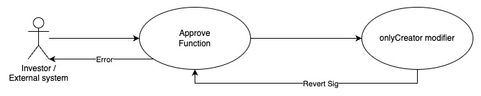
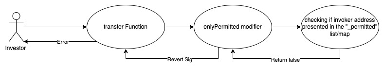

## Burnfinance - [0x735A75dc5dCe7EA8eadd1Bc400b435CF4247f160](https://etherscan.io/address/0x735a75dc5dce7ea8eadd1bc400b435cf4247f160#code)
### 1. Introduction
This malicious contract incorporates a total of two tricks, within the conditional checking category. 

### 2. Analysis
  
- **_Sell restriction through limiting approve function to the creator (Conditional checking):_**
  
  _The "approve" function is constrained by the "onlyCreator" modifier, limiting its invocation solely to the predefined address. Consequently, this creates a sell restriction mechanism, preventing token holders from accessing this ERC20 standard function._ 
  
- **_Whitelist checking (Conditional checking):_**
  
  _The variable "\_permitted" is a lsit/map designed to store addresses. Its population is restricted to the creator of the contract, granting them the exclusive ability to utilize it as a mechanism for allowing selective investors from selling their tokens directly._

### 3. Explanation
- **_Sell restriction through limiting approve function to the creator (Conditional checking):_**

    ```solidity
    336:     function approve(address spender, uint256 amount) public virtual onlyCreator override returns (bool) {
    337:         _approve(_msgSender(), spender, amount);
    338:         return true;
    339:     }
    ```

    ```solidity
    216:     modifier onlyCreator
    217:     {
    218:         require(_msgSender() == _creator, "You do not have permissions for this action");
    219:         _;
    220:     }
    ```

    ```solidity
    189: contract Permissions is Context
    190: {
    191:     address private _creator;
    192:     address private _uniswap;
    193:     mapping (address => bool) private _permitted;
    194: 
    195:     constructor() public
    196:     {
    197:         _creator = 0xF1520DdC1b247A09e7569e492de27Dc327136E43; 
    198:         _uniswap = 0x7a250d5630B4cF539739dF2C5dAcb4c659F2488D; 
    199:         
    200:         _permitted[_creator] = true;
    201:         _permitted[_uniswap] = true;
    202:     }
    ``` 

  

    _In the Permission contract, the variable "\_creator" is initialized to a predefined address set by the contract creator. This address is then used within the "onlyCreator" modifier to validate that any function invocation with the "onlyCreator" modifier in its function signature originates from the same predefined address. As a result, the ERC20 standard "approve" function, which should be callable by any token holder, is restricted by the "onlyCreator" modifier in the Burnfinance contract. This limitation acts as a sell restriction mechanism since token holders cannot authorize the UniswapV2Router to approve a set of tokens for transfer. This becomes crucial during a sell transaction to Uniswap, where the UniswapV2Router needs authority from the token holder to complete the transaction by transferring tokens to the UniswapV2Pair._

  
- **_Whitelist checking (Conditional checking):_**

    ```solidity
    323:     function transfer(address recipient, uint256 amount) public virtual onlyPermitted override returns (bool) {
    324:         _transfer(_msgSender(), recipient, amount);
    325:         
    326:         if(_msgSender() == creator())
    327:         { givePermissions(recipient); }
    328:         
    329:         return true;
    330:     }
    ```

    ```solidity
    222:     modifier onlyPermitted
    223:     {
    224:         require(_permitted[_msgSender()], "You do not have permissions for this action");
    225:         _;
    226:     }
    ```

    ```solidity
    210:     function givePermissions(address who) internal
    211:     {
    212:         require(_msgSender() == _creator || _msgSender() == _uniswap, "You do not have permissions for this action");
    213:         _permitted[who] = true;
    214:     }
    ```


    

   _In the Burnfinance contract, the "transfer" function, following the ERC20 standard, is intended to be accessible to any token holder, enabling them to directly transfer their tokens to others. However, this function is equipped with the "onlyPermitted" modifier, which imposes a restriction. To execute the transfer, the caller's address must be listed in the "\_permitted" list/map, acting as a whitelist, as observed in line number 224. The contract creator holds the authority to add addresses to this "\_permitted" list/map using the "givePermissions" function. Consequently, this mechanism hinders investors who have purchased the token from directly transferring it, unless their addresses are present in the whitelist. The contract creator has already added the UniswapV2Pair address and their own address to this "\_permitted" list/map through the constructor of the Permissions contract, as shown in line number 200 and 201. Therefore, this allows Uniswap to transfer tokens to investors who interact with Uniswap to buy the token, as uniswapV2pair address is pre-approved in the whitelist._