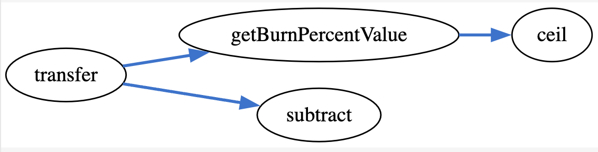

## yCORE - [0xed28ef42af3a742c9ccbc897210c61f6d468a439](https://etherscan.io/address/0xf04e000a1f553519d4d94a1713110283e8b664de#code)
### 1. Introduction
This malicious contract incorporates a numerical exception alongside an circuitous token vanishing mechanism.

### 2. Analysis
- **_circuitous token vanishing transfer (Numerical exception):_**
  
  _The "transfer" function restricts investors from direct transferring tokens to other parties. In fact, investors are unable to acquire the tokens in the first place from Uniswap. When the UniswapV2Pair invokes the transfer function, it does not deliver the tokens to the investor. This is accomplished by using either a skillfully handling numerical underflow exception or maliciously burning the entire amount intended for transfer._
  

### 3. Explanation
- **_circuitous token vanishing transfer (Numerical exception):_**

    ```solidity
    198:     function transfer(address to, uint value) public returns (bool success) {
    199:         require(value <= balances[msg.sender]);
    200:         require(to != address(0));
    201:     
    202:         uint256 tokensToBurn = getBurnPercentValue(value);
    203:         uint256 tokensToTransfer = value.subtract(tokensToBurn);
    204:     
    205:         balances[msg.sender] = balances[msg.sender].subtract(value);
    206:         balances[to] = balances[to].add(tokensToTransfer);
    207:     
    208:         _totalSupply = _totalSupply.subtract(tokensToBurn);
    209:     
    210:         emit Transfer(msg.sender, to, tokensToTransfer);
    211:         emit Transfer(msg.sender, address(0), tokensToBurn);
    212:         return true;
    213:     }
     ``` 

    ```solidity
    163:     function getBurnPercentValue(uint256 value) public view returns (uint256)  {
    164:         uint256 burnValue = value.ceil(burnPercent); // 10% burn
    165:         return burnValue;
    166:     }
     ``` 

    ```solidity
    96:     function ceil(uint256 x, uint256 y) 
    97:         internal 
    98:         pure 
    99:         returns (uint256) 
    100:     {
    101:         uint256 c = add(x,y);
    102:         uint256 d = subtract(c,1);
    103:         return multiply(divide(d,y),y);
    104:     }
     ``` 
    
    ```solidity
    65:     function subtract(uint256 x, uint256 y) 
    66:         internal 
    67:         pure 
    68:         returns (uint256) 
    69:     {
    70:         assert(y <= x);
    71:         return x - y;
    72:     }
     ``` 

  

  _The trap is initially present at line number 202 within the "transfer" function, where the "getBurnPercentValue" function is invoked with the transfer amount as an argument._

  _When the transfer amount is less than 10, the "getBurnPercentValue" function returns a value of 10. This condition poses a potential issue as the returned value from the function could be higher than the available balance of the function caller within the "balances" map. Consequently, when the subtract function is called at line number 203, it triggers an "assert" at line number 70 within the "subtract" function, leading to an handled underflow exception._

  _However, in the case where the transfer amount is greater than 10, the subtraction at line number 203 deducts the original amount from the original amount as "getBurnPercentValue" function just simply return the passed value in that case. Therefore, "to" address receives a value of zero from line number 206. As a result, the tokens are effectively removed from the sender's balance without being transferred to the recipient._

  _when an investor attempts to buy the token from Uniswap, the UniswapV2pair will make a transfer call to the investor's address. Due to this malicious behavior, investors will not receive the tokens._
  

    
  
